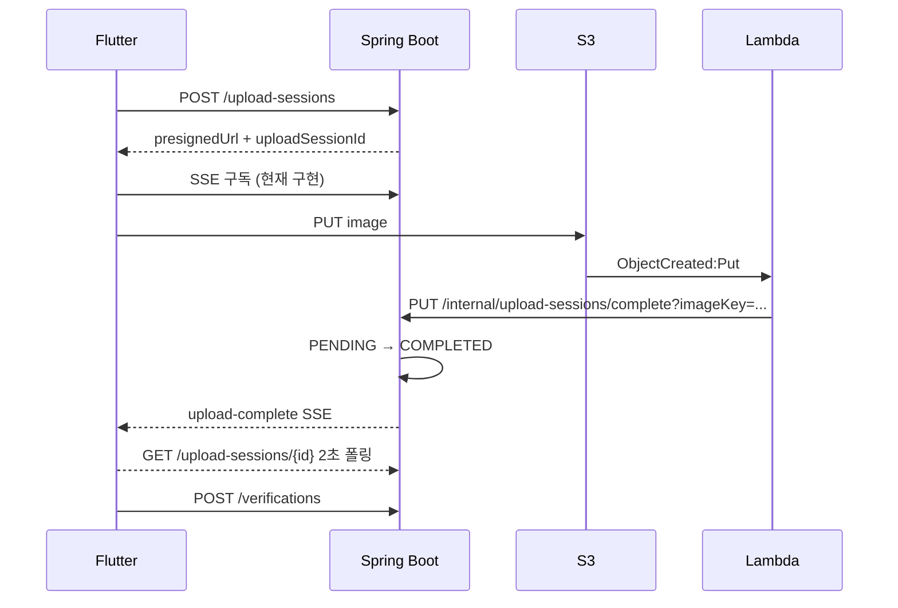

# Backend Handoff

> **현행 기준일:** 2026-08-20
>
> 이 문서는 다음 작업자가 현재 상태와 정본 위치를 빠르게 찾기 위한 인수인계 문서다.
> API 필드·에러·스키마·비즈니스 규칙을 여기서 다시 정의하지 않는다. 충돌하면 아래 정본이 우선한다.

---

## 1. 프로젝트와 현재 단계

TriAgain은 실패 후 다시 시작할 수 있는 3일 습관 사이클과 2~10명 크루를 제공하는 서비스다.
Phase 1 목표는 사용자 500명, TPS 50이며 현재 백엔드는 Java 17·Spring Boot 3.4.13 단일
애플리케이션으로 배포한다.

현재 문서 작업 브랜치는 `codex/docs-canonical-cross-check`다.

- 현재 단계: Phase A 문서 정본 교차검증
- 이 브랜치의 원칙: 문서와 코드의 차이를 기록하며 Java·설정·migration을 임의로 수정하지 않음
- 구현 변경은 문서 검토가 끝난 뒤 별도 승인으로 진행
- 상위 `sdd/`는 설계 이력이며 백엔드 현행 계약 정본은 `docs/spec/`다.

---

## 2. 정본 문서 라우팅

| 필요한 정보 | 정본 |
|---|---|
| API 경로·필드·nullable·HTTP·에러 | [`spec/api-spec.md`](./spec/api-spec.md) → 도메인별 파일 |
| 현재 비즈니스 규칙·엣지케이스 | [`spec/biz-logic.md`](./spec/biz-logic.md) |
| 테이블·상태·제약·인덱스 | [`spec/schema.md`](./spec/schema.md) 및 Flyway migration |
| 런타임·패키지·보안·Port/Adapter | [`spec/architecture.md`](./spec/architecture.md) |
| 컨텍스트 관계 | [`spec/context-map.md`](./spec/context-map.md) |
| User 로그인·탈퇴·재가입 개요 | [`spec/user.md`](./spec/user.md) |
| 사진 업로드 사용자 흐름 | [`spec/photo-upload-flow.md`](./spec/photo-upload-flow.md) |
| Lambda·S3·SSE 운영 경계 | [`spec/photo-upload-lambda-sse.md`](./spec/photo-upload-lambda-sse.md) |
| 운영 배포 | [`prod-deploy-checklist.md`](./prod-deploy-checklist.md) |
| 후속 결정·도입 보류 | [`log/future-considerations.md`](./log/future-considerations.md) |
| 과거 장애·판단 기록 | [`log/debugging-log.md`](./log/debugging-log.md) |

API 정본은 다음 여섯 파일로 나뉜다.

- `api-spec/auth-user.md`
- `api-spec/crew.md`
- `api-spec/verification.md`
- `api-spec/notification.md`
- `api-spec/habit.md`
- `api-spec/internal.md`

---

## 3. 런타임과 컨텍스트 상태

| 영역 | 상태 | 현재 책임 |
|---|---|---|
| User | 연결됨 | 카카오·Apple, JWT, 프로필, 탈퇴·재가입, FCM 토큰 |
| Crew | 연결됨 | 크루·멤버십·챌린지, 검색, 가입 동시성 |
| Verification | 연결됨 | 업로드 세션, 크루 인증, 피드, SSE |
| Support | 연결됨 | 인앱 알림, 조건부 FCM, 인증 리액션 |
| Habit | 연결됨 | 솔로 습관·3일 사이클·인증 |
| Moderation | 기반만 존재 | Report·Review Domain/JPA/Bridge 일부. 사용자 API·Application UseCase 없음 |
| Common | 공유 인프라 | 인증, 응답, 예외, Clock, Dead Letter, ChunkProcessor |

외부 구성요소:

- PostgreSQL 16 + Flyway
- AWS S3 presigned URL 직접 업로드
- S3 ObjectCreated → AWS Lambda → 내부 완료 API
- Firebase FCM (`firebase.enabled=true`일 때만 실제 전송)
- Kakao·Apple 소셜 API

Redis와 AWS SQS는 현재 런타임에 없다.

---

## 4. 현재 핵심 동작

### 크루와 챌린지

- 크루 가입 기본 전략은 `CONDITIONAL`이다.
- 정원은 조건부 원자적 UPDATE, 중복 멤버십은 DB 유니크 제약으로 보호한다.
- 설정으로 PESSIMISTIC·OPTIMISTIC을 선택할 수 있지만 현재 기본 계약은 아니다.
- 크루는 매일 00:00 활성화, 00:05 종료한다.
- 챌린지는 활성화 때 미리 만들지 않고 사용자의 첫 인증 때 lazy 생성한다.
- 3일 인증을 채우면 SUCCESS, 마감+grace를 넘기면 FAILED다.
- 실패 뒤 재인증 요청이 들어오면 새 챌린지를 만든다.

### 크루 인증

- TEXT는 텍스트가 필수다.
- PHOTO는 완료된 uploadSessionId가 필수이고 텍스트는 선택이다.
- 사진 마감 기준은 서버가 기록한 upload session `requestedAt`이다.
- 인증 생성 grace는 5분이며 서버에 별도 S3 장애 1시간 유예가 없다.
- 같은 사용자·크루·날짜의 유효 인증은 부분 유니크 인덱스로 하나만 허용한다.
- 인증 수정은 기존 행 UPDATE가 아니라 구행 CANCELLED + 신행 INSERT다.
- 리액션은 현재 `LIKE` 하나만 허용하며 수정된 신행으로 자동 이관하지 않는다.

### User

- 카카오·Apple 모두 로그인과 회원가입이 분리되어 있다.
- 신규·탈퇴 사용자는 로그인 API에서 자동 생성되지 않는다.
- Access Token 30분, Refresh Token 14일이며 rotation·서버 저장소는 없다.
- logout은 서버 no-op이고 탈퇴·재가입은 `tokenVersion`으로 기존 JWT를 무효화한다.
- 회원탈퇴는 soft delete이며 Apple refresh token revoke는 best-effort다.

### Habit

- 크루와 분리된 솔로 3일 사이클이다.
- 습관 생성만으로 사이클을 시작하지 않으며 사용자가 TODAY/TOMORROW로 시작한다.
- PAUSED, ENDED 상태가 있고 실패 뒤 재시작도 사용자 명시 요청이다.
- Habit 변경 서비스는 habit 행 비관적 lock으로 자기 경합을 직렬화한다.
- 크루와 달리 자정을 넘긴 전날 슬롯 제출을 허용하지 않는다.

### 알림

- 현재 자동 생성되는 타입은 `CREW_STARTED`, `REMINDER`, 조건부
  `CREW_FIRST_VERIFICATION`이다.
- Challenge SUCCESS 리스너와 FAILED 알림 호출은 현재 비활성이다.
- 인앱 알림을 먼저 저장하고 FCM은 best-effort다.
- 첫 인증 알림은 **아래 4개를 모두 통과한 수신자에게만** 인앱 알림이 저장된다.
  ① 기능 게이트 `notification.crew-first-verification.enabled` — 리스너의 `@ConditionalOnProperty`가
     `matchIfMissing=false`라 미설정이면 리스너 자체가 없다. prod는 `CREW_FIRST_VERIFICATION_ENABLED`
     기본값으로 ON이고, 그 외 프로필은 기본 OFF다.
  ② 시간창 `[08:00, 22:00)`
  ③ 당일 해당 크루 중복 방지
  ④ 수신자 존재 — 본인 제외 ACTIVE 멤버가 없으면 종료
  발송은 즉시가 아니라 트랜잭션 커밋 후 비동기다.
- FCM은 그 위의 별개 축이다. ①~④를 통과한 수신자 중 `fcmToken`이 있는 경우에만 시도하며,
  실제 전송 여부는 `firebase.enabled`가 정한다(꺼져 있으면 no-op 어댑터). 즉 **FCM이 꺼져 있어도
  인앱 알림은 저장된다.** 전송 실패는 로그만 남기고 삼킨다.
- 사용자별 종류·시간대·방해 금지 정책은 제품 확정 전이다.

---

## 5. 사진 업로드 완료 흐름



- UploadSession 상태는 `PENDING`, `COMPLETED`, `EXPIRED`다. `USED` 상태는 없다.
- 사용 여부는 verification·habit_verification의 upload_session 유니크 제약으로 보호한다.
- Lambda 완료 상태 전이는 멱등이지만 재호출 때 SSE 전송은 다시 시도한다.
- 운영 `/internal/**`은 JWT 대신 Internal API Key Filter가 보호한다.
- dev/test에는 Internal API Key Filter가 없다.

---

## 6. 현재 구현 공백과 우선순위

### 우선 해결 제안

1. SHA 이미지 배포와 health 실패 자동 rollback
2. 추적 가능한 안전한 `application-local.yml` 정리

SSE 인증·소유권 검증과 `GET /upload-sessions/{id}` 폴링 API는 구현됐다 (BE #165). 둘은 응용 계층
`getOwnedOrThrow(id, userId)` 한 곳을 공유한다. 다만 `SseEmitterAdapter`가 세션 ID당 emitter 하나만
저장하는 구조는 그대로라 **같은 세션의 재연결·다중 연결이 이전 emitter를 덮어쓴다.**

### 확인된 도메인·구현 차이

- Habit용 upload session은 `crewId=null`인데 Crew 인증 검증이 이를 거부하지 않는 비대칭이 있다.
- 같은 upload session이 크루 인증 테이블과 Habit 인증 테이블에서 각각 한 번 사용될 수 있다.
- Notification 업무키 유니크 제약이 없어 스케줄러 다중 실행 시 중복 알림 가능성이 있다.
- 오래된 알림 삭제 Repository 메서드는 있으나 호출 스케줄러가 없다.
- Crew·Verification의 알림 Adapter가 Support 내부 타입과 Port를 직접 import한다.

### 도입 보류

- Lambda 최종 실패 보관용 SQS DLQ·OnFailure Destination과 경보
- Redis 기반 분산 기능·토큰 블랙리스트
- 사용자별 알림 수신 종류·시간대 정책
- 상위 `sdd/solo-habit` 변경 이력 보강

보류 사유와 재검토 조건은 `future-considerations.md`를 따른다.

---

## 7. 배포 현행

- PR에서는 `./gradlew build`와 `./gradlew e2eTest` 잡이 순서대로 실행된다.
- push에서는 테스트 잡을 기다리지 않고 `main`, `develop` 모두 같은 운영 EC2에 배포된다.
- Docker Hub에 `latest`와 SHA를 push하지만 EC2는 `latest`를 실행한다.
- 기존 컨테이너를 먼저 제거하며 health 실패 자동 rollback이 없다.
- Firebase는 EC2 key 파일 존재 여부만 보고 활성화하며 배포 후 실제 FCM 스모크는 자동화되지 않았다.
- Lambda GitHub Actions는 SAM stack을 배포하지만 S3 notification·invoke permission은 수동 스크립트
  또는 저장소 밖 기존 설정에 의존한다.
- Flyway는 별도 migration job이 아니라 애플리케이션 부팅 때 실행된다.

상세 체크와 저장소 밖 확인 항목은 `prod-deploy-checklist.md`를 따른다.

---

## 8. 검증 명령

Java를 수정하면 다음 세 단계를 모두 통과해야 한다.

```bash
./gradlew checkstyleMain checkstyleTest
./gradlew compileJava compileTestJava -x test
./gradlew test
```

e2e 태그 테스트는 일반 `test`에서 제외되므로 필요한 변경은 별도로 실행한다.

```bash
./gradlew cleanE2eTest e2eTest
```

- H2 test profile은 Flyway OFF·`create-drop`이다.
- PostgreSQL 전용 쿼리·제약은 integration/Testcontainers 테스트로 검증한다.
- Dockerfile의 빌드 단계는 `bootJar`만 수행하며 테스트 게이트가 아니다.

---

## 9. 구현 규칙 요약

- 문서 확정 → 구현 → 테스트 순서를 지킨다.
- Controller는 Inbound UseCase에 의존하고 비즈니스 로직을 두지 않는다.
- Domain은 Spring·JPA·AWS에 의존하지 않는다.
- aggregate 간 영속 참조는 객체 관계 대신 ID를 사용한다.
- JPA Entity와 Adapter는 infra에 둔다.
- ID는 `PREFIX-<하이픈 없는 UUID 앞 16자>` 형식이다.
- 모든 API는 `ApiResponse<T>`로 감싼다.
- Java 메서드 길이 정본은 Checkstyle `MethodLength` 최대 30줄이다.
- 새 API·도메인·테스트 변경은 `.claude/skills/`의 해당 지침을 먼저 읽는다.
- 설정·배포 파일 변경은 `.claude/rules/config-deploy.md`를 먼저 읽는다.

세부 규칙은 저장소 루트 `CLAUDE.md`와 `.claude/rules/`가 정본이다.
