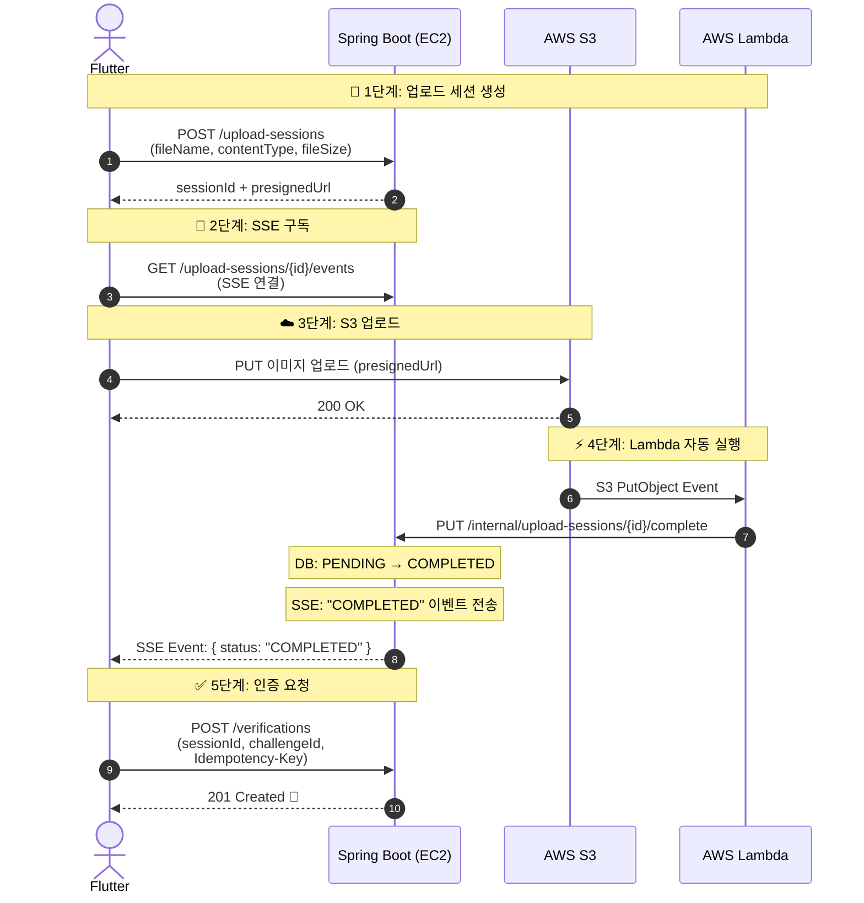

# 사진 인증 업로드 프로세스 - Lambda + SSE 설계

> **변경 사유**: 기존 방식은 클라이언트가 API 2번 순차 호출 + upload_session COMPLETED 처리를 /verifications에서 담당.
> 변경 후 Lambda가 업로드 완료를 감지하고 SSE로 프론트에 알림 → 클라이언트 의존 제거, 책임 분리.

## 1. 전체 플로우

```
[기존 방식]
  POST /upload-sessions → presignedUrl
  클라이언트 → S3 업로드
  POST /verifications → 인증 생성 + session COMPLETED  ← 여기서 너무 많은 일

[변경 방식]
  POST /upload-sessions → presignedUrl + SSE 구독 시작
  클라이언트 → S3 업로드
  S3 Event → Lambda → session COMPLETED + SSE 알림
  클라이언트가 SSE 이벤트 수신 → POST /verifications ← 인증 로직에만 집중
```

## 2. 시퀀스 다이어그램



## 3. 컴포넌트별 책임

### Spring Boot (EC2)

| API | 책임 |
|-----|------|
| `POST /upload-sessions` | 메타데이터 검증 + session INSERT(PENDING) + presignedUrl 생성 |
| `GET /upload-sessions/{id}/events` | SSE 엔드포인트 (프론트 구독용) |
| `PUT /internal/upload-sessions/{id}/complete` | Lambda 전용 내부 API → session COMPLETED + SSE 이벤트 발행 |
| `POST /verifications` | 인증 생성 (session COMPLETED 확인 후) |

**SSE 구현:**
```java
// SSE 엔드포인트
@GetMapping("/upload-sessions/{id}/events")
public SseEmitter subscribe(@PathVariable String id) {
    SseEmitter emitter = new SseEmitter(60_000L); // 60초 타임아웃
    uploadSessionSseManager.add(id, emitter);
    return emitter;
}

// Lambda 콜백 시 SSE 전송
@PutMapping("/internal/upload-sessions/{id}/complete")
public void complete(@PathVariable String id) {
    uploadSessionService.complete(id);           // DB: PENDING → COMPLETED
    uploadSessionSseManager.send(id, "COMPLETED"); // SSE 이벤트 전송
}
```

**내부 API 보안:**
- `/internal/**` 경로는 외부 접근 차단 (Security 설정)
- Lambda에서만 호출 가능 (VPC 내부 통신 or API Key)

### AWS Lambda (Java)

```java
public class UploadCompleteHandler implements RequestHandler<S3Event, Void> {

    public Void handleRequest(S3Event event, Context context) {
        // 1. S3 key 추출
        String imageKey = event.getRecords().get(0).getS3().getObject().getKey();
        // imageKey: "upload-sessions/{userId}/{uuid}.{ext}"

        // 2. Spring Boot 내부 API 호출 (imageKey로 session 조회)
        httpClient.put(EC2_URL + "/internal/upload-sessions/complete?imageKey=" + imageKey);

        return null;
    }
}
```

**Lambda 설정:**
- Runtime: Java 17
- 트리거: S3 PutObject Event (버킷: triagain-verifications, prefix: upload-sessions/)
- 타임아웃: 10초
- 재시도: 2회 (AWS 기본)
- 실패 시: DLQ(Dead Letter Queue)로 전달

### S3

- **버킷**: triagain-verifications
- **Key 규칙**: `upload-sessions/{userId}/{uuid}.{ext}`
- **Event Notification**: PutObject → Lambda 트리거
- **CORS**: Flutter에서 직접 업로드 허용

### Flutter

```dart
// 1. 세션 생성
final session = await api.createUploadSession(file);

// 2. SSE 구독 시작
final sseStream = api.subscribeUploadEvents(session.id);

// 3. S3 업로드
await s3.upload(session.presignedUrl, file);

// 4. SSE 이벤트 대기
sseStream.listen((event) {
  if (event.status == 'COMPLETED') {
    // 5. 인증 요청
    api.createVerification(session.id, challengeId);
  }
});

// 타임아웃: 30초 내 COMPLETED 안 오면 재시도 안내
```

## 4. 텍스트 인증 (사진 없음)

사진 없이 텍스트만 인증하는 경우:
```
POST /verifications 바로 호출 (uploadSessionId = null)
→ Lambda, SSE, S3 전부 스킵
→ 바로 APPROVED
```

## 5. 기존 대비 변경점

| 항목 | Before | After |
|------|--------|-------|
| session COMPLETED 처리 | /verifications 트랜잭션 내 | Lambda → /internal API |
| 업로드 완료 감지 | 클라이언트가 /verifications 호출 | S3 Event → Lambda 자동 감지 |
| 프론트 알림 | 없음 (동기 호출) | SSE로 실시간 알림 |
| /verifications 책임 | 세션확인 + 인증생성 + 세션완료 | 인증 생성만 (session COMPLETED 확인만) |
| 인프라 추가 | 없음 | Lambda + S3 Event Notification |

## 6. 실패 처리

| 실패 상황 | 처리 방법 |
|-----------|-----------|
| S3 업로드 실패 | 클라이언트 재시도 → 실패 시 안내 |
| Lambda 실행 실패 | AWS 자동 재시도 2회 → DLQ |
| Lambda → EC2 호출 실패 | Lambda 재시도 → 최종 실패 시 DLQ |
| SSE 타임아웃 (60초) | 클라이언트가 폴링 fallback (GET /upload-sessions/{id}) |
| SSE 연결 끊김 | 클라이언트 재연결 + 상태 확인 |
| PENDING 세션 방치 | 스케줄러: 15분 후 EXPIRED 처리 (5분 주기 체크) |

## 7. /verifications 변경된 책임

```
[Before - /verifications에서 하던 일]
1. 멱등성 검사
2. 분산 락 획득
3. upload_session 확인 (PENDING → COMPLETED)  ← 삭제
4. 챌린지 비관적 락
5. 마감 시간 검증
6. verification INSERT
7. upload_session COMPLETED UPDATE             ← 삭제
8. 멱등성 완료
9. 락 해제

[After - /verifications에서 하는 일]
1. 멱등성 검사
2. 분산 락 획득
3. upload_session 상태 확인 (COMPLETED인지만 체크) ← 확인만!
4. 챌린지 비관적 락
5. 마감 시간 검증
6. verification INSERT
7. 멱등성 완료
8. 락 해제
```

## 8. 구현 순서 (Claude Code 작업 단위)

```
1단계: Spring Boot
  - POST /upload-sessions (기존 유지)
  - GET /upload-sessions/{id}/events (SSE 엔드포인트 신규)
  - PUT /internal/upload-sessions/{id}/complete (내부 API 신규)
  - SseEmitter 관리 클래스 (UploadSessionSseManager)

2단계: Lambda
  - S3 Event 트리거 Handler
  - EC2 내부 API 호출 로직
  - 배포 설정 (SAM or Terraform)

3단계: Flutter
  - SSE 구독 로직
  - 업로드 → SSE 대기 → 인증 요청 플로우
  - 타임아웃/재연결 처리

4단계: 통합 테스트
  - 사진 인증 E2E 테스트
  - Lambda 실패 시 fallback 테스트
  - SSE 타임아웃 테스트
```
