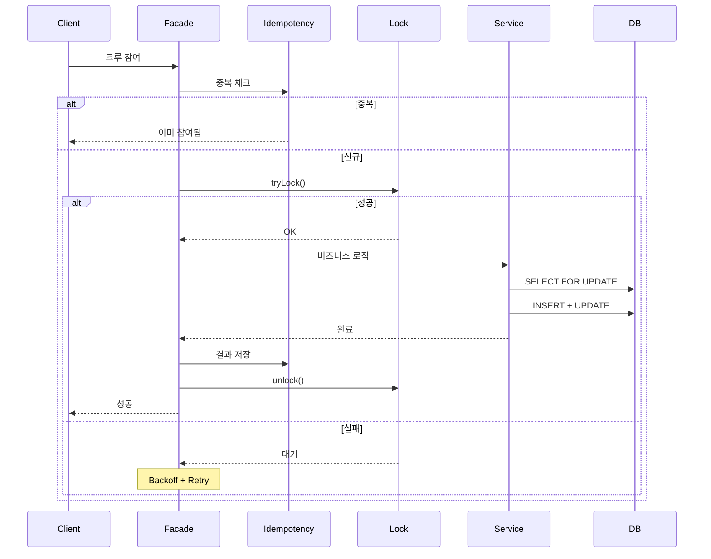
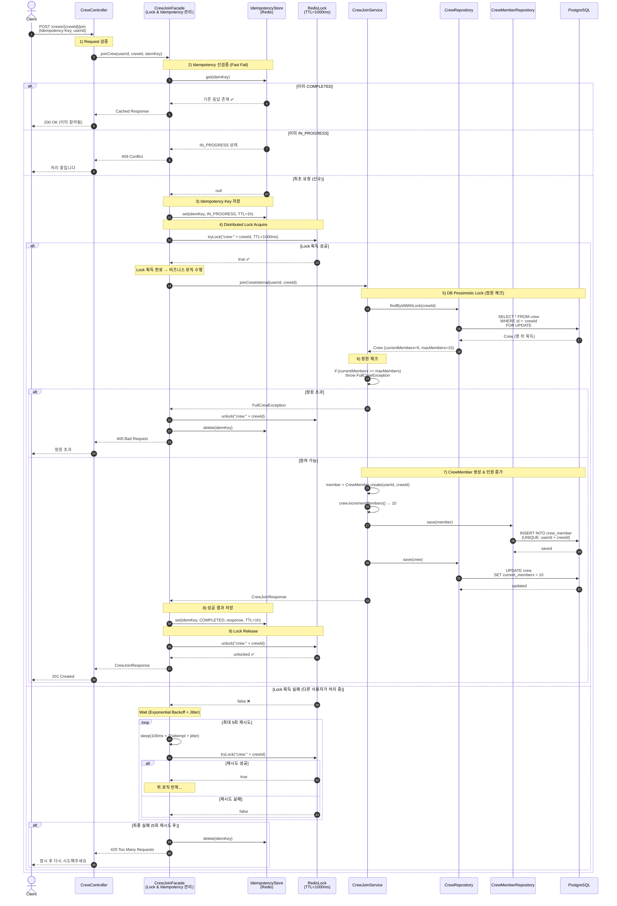

# 시퀀스 다이어그램 - 크루 가입

## 1. 전체 흐름 (간략)

## 2. 크루 가입 상세

## 3. 동시성 제어 전략

크루 가입은 **3중 보호**로 동시성을 제어한다.

| 계층 | 방식 | 목적 |
|------|------|------|
| 1층 | Idempotency Key | 동일 요청 중복 방지 |
| 2층 | Distributed Lock (Redis) | 동시 요청 직렬화 |
| 3층 | Pessimistic Lock (DB) | 정원 정합성 보장 |

**왜 3중인가?**
- Idempotency: 같은 사용자가 버튼 연타하는 경우
- Distributed Lock: 서로 다른 사용자가 동시에 참여하는 경우
- Pessimistic Lock: 분산 락 없이도 DB 레벨에서 최종 방어
