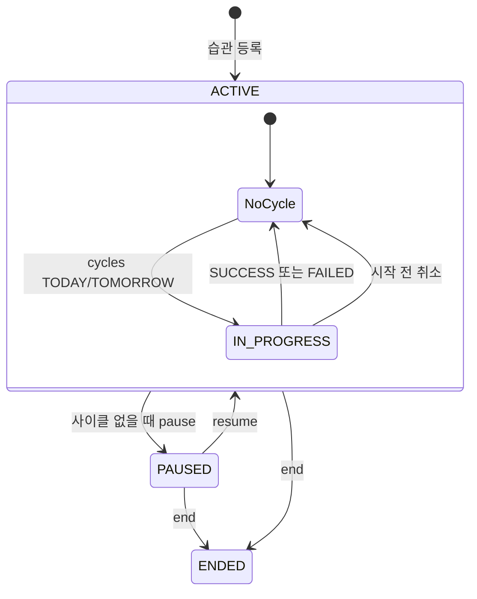

# API 명세 — 습관·솔로 모드 (Habit)

> 전체 인덱스: [`../api-spec.md`](../api-spec.md) · 이 문서가 Habit HTTP 계약의 정본이다.
> 최초 결정 배경은 백엔드 상위 `sdd/solo-habit/`에 있고, 이 문서는 이후 구현 변경까지 반영한
> **현재 계약**을 설명한다.

## 1. 공통 계약

- 모든 엔드포인트에 `Authorization: Bearer <accessToken>`이 필요하다.
- 인증 실패는 `401 A003`이다.
- 성공 JSON은 `{"success":true,"data":...,"error":null}` 형식이다.
- 실패 JSON은 `{"success":false,"data":null,"error":{"code":"...","message":"..."}}` 형식이다.
- `204 No Content`는 Body가 없다.
- Request Body의 Bean Validation 실패는 `400 C001`이다.
- 등록을 제외한 변경 API는 `ENDED` 습관을 찾지 않은 것처럼 처리하여 `404 HB001`을 반환한다.
- 기존 습관을 대상으로 하는 변경 API는 소유자를 확인하며 불일치는 `403 HB005`다.
- 날짜·시각은 ISO-8601 형식이다.

## 2. 요청·응답 모델

표의 nullable이 `아니요`인 응답 필드는 성공 시 항상 존재한다. 목록은 결과가 없으면 `[]`이며
`null`을 반환하지 않는다.

### 2.1 습관 생성 요청

| 필드 | JSON 타입 | 필수 | 규칙 |
|---|---|---|---|
| `name` | string | 예 | 공백 불가, 최대 50자 |
| `verificationType` | string | 예 | `TEXT`, `PHOTO` |
| `verificationContent` | string | 아니요 | 인증 안내 문구, 최대 100자. null·blank는 null로 저장 |
| `deadlineTime` | string(time) | 아니요 | 기본 `23:59:59` |

### 2.2 습관 단건 `HabitResponse`

등록·이름 수정·종료·멈춤·재개 응답이 공유한다.

| 필드 | JSON 타입 | nullable | 의미 |
|---|---|---|---|
| `habitId` | string | 아니요 | `HBIT-` prefix 습관 ID |
| `name` | string | 아니요 | 습관 이름 |
| `verificationType` | string | 아니요 | `TEXT`, `PHOTO` |
| `verificationContent` | string | 예 | 인증 안내 문구. 미설정이면 null |
| `deadlineTime` | string(time) | 아니요 | 일일 인증 마감 시각 |
| `status` | string | 아니요 | `ACTIVE`, `PAUSED`, `ENDED` |
| `createdAt` | string(date-time) | 아니요 | 등록 시각 |
| `endedAt` | string(date-time) | 예 | `ENDED` 전이 시각. 종료 전에는 null |

### 2.3 홈 목록 `HabitListItemResponse`

| 필드 | JSON 타입 | nullable | 의미 |
|---|---|---|---|
| `habitId` | string | 아니요 | 습관 ID |
| `name` | string | 아니요 | 습관 이름 |
| `verificationType` | string | 아니요 | `TEXT`, `PHOTO` |
| `verificationContent` | string | 예 | 인증 안내 문구 |
| `deadlineTime` | string(time) | 아니요 | 일일 인증 마감 시각 |
| `status` | string | 아니요 | 목록에는 `ACTIVE`, `PAUSED`만 존재 |
| `successCount` | number | 아니요 | 해당 습관의 `SUCCESS` 사이클 수 |
| `todayVerified` | boolean | 아니요 | 오늘 날짜의 솔로 인증 존재 여부 |
| `activeCycle` | object | 예 | `IN_PROGRESS` 사이클. 없으면 null |

### 2.4 사이클 `HabitCycleResponse`

| 필드 | JSON 타입 | nullable | 의미 |
|---|---|---|---|
| `cycleId` | string | 아니요 | `HCYC-` prefix 사이클 ID |
| `cycleNumber` | number | 아니요 | 습관 안의 시도 순번, 첫 사이클은 1 |
| `completedDays` | number | 아니요 | 현재 사이클에서 완료한 슬롯 수 |
| `targetDays` | number | 아니요 | 현재 항상 3 |
| `status` | string | 아니요 | 활성 응답에서는 `IN_PROGRESS`; 인증 결과에서는 `SUCCESS` 가능 |
| `startDate` | string(date) | 아니요 | 시작 날짜 |
| `deadline` | string(date-time) | 아니요 | `startDate + 3일`의 습관 마감 시각 |

### 2.5 지난기록 `ArchivedHabitResponse`

| 필드 | JSON 타입 | nullable | 의미 |
|---|---|---|---|
| `habitId` | string | 아니요 | 종료한 습관 ID |
| `name` | string | 아니요 | 습관 이름 |
| `verificationType` | string | 아니요 | `TEXT`, `PHOTO` |
| `successCount` | number | 아니요 | 종료 전 누적 `SUCCESS` 사이클 수 |
| `endedAt` | string(date-time) | 아니요 | 종료 시각 |

### 2.6 인증 요청과 결과

요청:

| 필드 | JSON 타입 | 필수 | 규칙 |
|---|---|---|---|
| `uploadSessionId` | number | 조건부 | `PHOTO` 습관에 필수. `TEXT`에서는 보내지 않음 |
| `textContent` | string | 조건부 | `TEXT`에 필수, `PHOTO`에서는 선택 |

현재 `CreateHabitVerificationRequest`에는 문자열 길이 Bean Validation이 없다.
`textContent`는 DB `VARCHAR(500)`이므로 500자를 넘는 입력을 HTTP 경계에서 미리 거부하지 못한다.

결과:

| 필드 | JSON 타입 | nullable | 의미 |
|---|---|---|---|
| `verificationId` | string | 아니요 | `HVRF-` prefix 인증 ID |
| `habitCycleId` | string | 아니요 | 인증 대상 사이클 ID |
| `habitId` | string | 아니요 | 인증 대상 습관 ID |
| `imageUrl` | string | 예 | 사진 인증 이미지. 텍스트 인증은 null |
| `textContent` | string | 예 | 인증 텍스트. 사진 인증에서는 미입력 가능 |
| `targetDate` | string(date) | 아니요 | 인증 슬롯 날짜 |
| `attemptNumber` | number | 아니요 | 사이클 안의 인증 순번, `completedDays + 1` |
| `cycle` | object | 아니요 | 인증 반영 후 사이클 진행 상태 |
| `cycle.completedDays` | number | 아니요 | 인증 반영 후 완료 슬롯 수 |
| `cycle.targetDays` | number | 아니요 | 현재 3 |
| `cycle.status` | string | 아니요 | `IN_PROGRESS`, 세 번째 인증이면 `SUCCESS` |

## 3. 에러 코드

| HTTP | 코드 | 기본 메시지 |
|---|---|---|
| 400 | C001 | 잘못된 입력값입니다. 또는 필드 검증 메시지 |
| 401 | A003 | 인증이 필요합니다. |
| 404 | HB001 | 습관을 찾을 수 없습니다. |
| 409 | HB002 | 이미 진행 중인 작심이 있습니다. |
| 400 | HB003 | 진행 중인 작심이 없습니다. |
| 400 | HB004 | 진행 중인 작심이 있으면 멈출 수 없습니다. |
| 403 | HB005 | 본인 습관만 이용할 수 있습니다. |
| 400 | HB006 | 아직 시작일이 되지 않은 작심입니다. |
| 400 | HB007 | 시작일이 지난 작심은 취소할 수 없습니다. |
| 400 | HB008 | 멈춘 습관입니다. 재개 후 이용할 수 있습니다. |
| 400 | HB009 | 다른 습관용으로 발급된 업로드 세션입니다. |
| 409 | HB010 | 이미 오늘 인증을 완료했습니다. |
| 400 | V002 | 인증 마감 시간이 지났습니다. |
| 409 | V003 | 이미 해당 날짜에 인증이 존재합니다. |
| 404 | V004 | 업로드 세션을 찾을 수 없습니다. |
| 400 | V005 | 업로드 세션이 완료되지 않았습니다. |
| 400 | V006 | 업로드 세션이 만료되었습니다. |
| 400 | V009 | 사진 인증이 필요합니다. |
| 400 | V010 | 텍스트 인증 시 텍스트는 필수입니다. |
| 400 | V011 | 사진 인증 시 이미지 URL은 필수입니다. |
| 409 | V015 | 이미 사용된 업로드 세션입니다. |
| 400 | V016 | 업로드 세션의 크루 정보가 일치하지 않습니다. |
| 400 | V017 | 텍스트 인증 크루에서는 업로드 세션이 필요하지 않습니다. |

`V017`의 메시지는 Crew 중심 문구지만 Habit의 TEXT 업로드 세션 발급에도 같은 코드를 재사용한다.

## 4. 습관 API

### POST /habits

습관을 `ACTIVE` 상태로 등록한다. 등록만으로 사이클을 만들지 않는다.

**Request**

```json
{
  "name": "매일 물 2L",
  "verificationType": "TEXT",
  "verificationContent": "물 2L를 마셨는지 적어주세요",
  "deadlineTime": "23:59:59"
}
```

**성공: `201 Created`**

```json
{
  "success": true,
  "data": {
    "habitId": "HBIT-a1b2c3d4e5f60708",
    "name": "매일 물 2L",
    "verificationType": "TEXT",
    "verificationContent": "물 2L를 마셨는지 적어주세요",
    "deadlineTime": "23:59:59",
    "status": "ACTIVE",
    "createdAt": "2026-07-05T14:30:00",
    "endedAt": null
  },
  "error": null
}
```

| HTTP | 코드 | 조건 |
|---|---|---|
| 400 | C001 | 이름·인증 방식·안내 문구·시각의 입력 검증 실패 |

### GET /habits

본인의 `ACTIVE`, `PAUSED` 습관을 등록 시각 오름차순으로 조회한다.

**성공: `200 OK`**

```json
{
  "success": true,
  "data": [
    {
      "habitId": "HBIT-a1b2c3d4e5f60708",
      "name": "매일 물 2L",
      "verificationType": "TEXT",
      "verificationContent": null,
      "deadlineTime": "23:59:59",
      "status": "ACTIVE",
      "successCount": 4,
      "todayVerified": false,
      "activeCycle": {
        "cycleId": "HCYC-0102030405060708",
        "cycleNumber": 7,
        "completedDays": 1,
        "targetDays": 3,
        "status": "IN_PROGRESS",
        "startDate": "2026-07-04",
        "deadline": "2026-07-07T23:59:59"
      }
    }
  ],
  "error": null
}
```

- `PAUSED`, 등록 직후, `SUCCESS`·`FAILED` 직후에는 `activeCycle`이 null이다.
- `startDate`가 미래인 활성 사이클은 내일 시작 예약이다.
- 단건 `GET /habits/{id}`는 현재 제공하지 않는다.

### GET /habits/archived

본인의 `ENDED` 습관을 `endedAt DESC`로 조회한다. 읽기 전용이며 결과가 없으면 `[]`이다.

**성공: `200 OK`**

```json
{
  "success": true,
  "data": [
    {
      "habitId": "HBIT-a1b2c3d4e5f60708",
      "name": "매일 물 2L",
      "verificationType": "TEXT",
      "successCount": 6,
      "endedAt": "2026-07-05T21:30:00"
    }
  ],
  "error": null
}
```

### PATCH /habits/{habitId}

습관 이름만 수정한다. 인증 방식·안내 문구·마감 시각은 현재 수정할 수 없다.

```json
{"name":"매일 물 3L"}
```

**성공: `200 OK`** — `HabitResponse`

| HTTP | 코드 | 조건 |
|---|---|---|
| 400 | C001 | 이름이 없거나 blank 또는 50자 초과 |
| 403 | HB005 | 다른 사용자의 습관 |
| 404 | HB001 | 습관 없음 또는 이미 `ENDED` |

### POST /habits/{habitId}/end

습관을 삭제하지 않고 `ENDED`로 전환하여 지난기록으로 보낸다.

- `ACTIVE`, `PAUSED`에서 가능하다.
- `IN_PROGRESS` 사이클이 있으면 같은 트랜잭션에서 `FAILED`로 바꾼다.
- `endedAt`을 기록한다.
- `ENDED`는 터미널이며 다시 시작하거나 재개할 수 없다.

**성공: `200 OK`** — `status=ENDED`, `endedAt`이 채워진 `HabitResponse`

| HTTP | 코드 | 조건 |
|---|---|---|
| 403 | HB005 | 다른 사용자의 습관 |
| 404 | HB001 | 습관 없음 또는 이미 `ENDED` |

### POST /habits/{habitId}/pause

진행 중 사이클이 없는 습관을 `PAUSED`로 바꾼다. 이미 `PAUSED`이면 상태를 유지하고 `200`을 반환한다.

**성공: `200 OK`** — `status=PAUSED`인 `HabitResponse`

| HTTP | 코드 | 조건 |
|---|---|---|
| 400 | HB004 | `IN_PROGRESS` 사이클 존재 |
| 403 | HB005 | 다른 사용자의 습관 |
| 404 | HB001 | 습관 없음 또는 이미 `ENDED` |

### POST /habits/{habitId}/resume

`PAUSED` 습관을 `ACTIVE`로 바꾼다. 이미 `ACTIVE`이면 상태를 유지하고 `200`을 반환한다.

**성공: `200 OK`** — `status=ACTIVE`인 `HabitResponse`

| HTTP | 코드 | 조건 |
|---|---|---|
| 403 | HB005 | 다른 사용자의 습관 |
| 404 | HB001 | 습관 없음 또는 이미 `ENDED` |

## 5. 사이클 API

### POST /habits/{habitId}/cycles

첫 사이클과 재도전을 같은 API로 시작한다. Request Body 전체를 생략하거나 `startOption`을
null로 보내면 `TODAY`다.

```json
{"startOption":"TODAY"}
```

| 값 | 시작일 | 추가 가드 |
|---|---|---|
| `TODAY` | 오늘 | 현재 시각이 오늘 마감+5분 이내이고 오늘 인증이 없어야 함 |
| `TOMORROW` | 내일 | TODAY 전용 마감·오늘 인증 가드를 적용하지 않음 |

`cycleNumber`는 기존 최대값 + 1이다. `deadline`은 `startDate + 3일`의 습관 마감 시각이다.

**신규 생성 성공: `201 Created`**

```json
{
  "success": true,
  "data": {
    "cycleId": "HCYC-0102030405060708",
    "cycleNumber": 7,
    "completedDays": 0,
    "targetDays": 3,
    "status": "IN_PROGRESS",
    "startDate": "2026-07-05",
    "deadline": "2026-07-08T23:59:59"
  },
  "error": null
}
```

저장 시 부분 유니크 제약 경합을 서비스 안에서 감지하여 기존 `IN_PROGRESS` 사이클을 찾은 경우에는
같은 응답 Body를 `200 OK`로 반환한다. 반면 요청을 처리하기 전에 이미 활성 사이클이 보이면
`409 HB002`다. Habit 행 비관적 락 때문에 일반적인 동시 더블탭은 후자의 순차 경로가 된다.

| HTTP | 코드 | 조건 |
|---|---|---|
| 400 | V002 | `TODAY`인데 오늘 마감+5분 경과 |
| 400 | HB003 | 제약 경합 후 기존 활성 사이클 재조회 실패 |
| 400 | HB008 | `PAUSED` 습관 |
| 403 | HB005 | 다른 사용자의 습관 |
| 404 | HB001 | 습관 없음 또는 이미 `ENDED` |
| 409 | HB002 | 요청 시작 시 이미 `IN_PROGRESS` 사이클 존재 |
| 409 | V003 | `TODAY`인데 오늘 인증이 이미 존재 |

> **현재 입력 경계:** `StartCycleRequest`에는 `@Valid`가 없고 잘못된 enum JSON은
> `HttpMessageNotReadableException`이 된다. 전용 Handler가 없어 일반 `500 C002`로 처리될 수 있다.

### DELETE /habits/{habitId}/cycles/current

오늘보다 `startDate`가 미래인 `IN_PROGRESS` 사이클만 hard delete한다.
시작 전에는 인증 생성이 금지되므로 정상 경로에서 자식 인증은 없다.

**성공: `204 No Content`**

| HTTP | 코드 | 조건 |
|---|---|---|
| 400 | HB003 | `IN_PROGRESS` 사이클 없음 |
| 400 | HB007 | 시작일이 오늘이거나 과거 |
| 403 | HB005 | 다른 사용자의 습관 |
| 404 | HB001 | 습관 없음 또는 이미 `ENDED` |

## 6. 솔로 인증 API

### POST /habits/{habitId}/verifications

진행 중 사이클의 오늘 슬롯을 인증한다. `Idempotency-Key`와 응답 캐시는 사용하지 않는다.

```json
{
  "uploadSessionId": 123,
  "textContent": "오늘도 물 2L 완료"
}
```

**성공: `201 Created`**

```json
{
  "success": true,
  "data": {
    "verificationId": "HVRF-1122334455667788",
    "habitCycleId": "HCYC-0102030405060708",
    "habitId": "HBIT-a1b2c3d4e5f60708",
    "imageUrl": null,
    "textContent": "오늘도 물 2L 완료",
    "targetDate": "2026-07-05",
    "attemptNumber": 2,
    "cycle": {
      "completedDays": 2,
      "targetDays": 3,
      "status": "IN_PROGRESS"
    }
  },
  "error": null
}
```

가드와 처리 순서:

1. 습관 존재·소유자·`ACTIVE`
2. `IN_PROGRESS` 사이클 존재
3. 오늘이 `startDate` 이후인지 확인
4. 오늘이 `startDate + completedDays` 기대 슬롯인지 확인
5. 오늘 인증 중복 확인
6. 인증 방식과 업로드 세션 소유·컨텍스트·상태 확인
7. TEXT는 현재 시각, PHOTO는 세션 `requestedAt`으로 사이클 마감 확인
8. 인증 저장과 `completedDays + 1`, 필요 시 `SUCCESS` 전환을 한 트랜잭션에서 처리

TEXT는 `textContent`가 필수다. PHOTO는 완료된 본인 세션이 필요하고 `textContent`는 선택이다.
PHOTO 세션은 `crewId=null`, `habitId` 일치여야 한다.

| HTTP | 코드 | 조건 |
|---|---|---|
| 400 | HB003 | `IN_PROGRESS` 사이클 없음 |
| 400 | HB006 | 내일 시작 사이클을 미리 인증 |
| 400 | HB008 | `PAUSED` 습관 |
| 400 | HB009 | 다른 습관에 묶인 세션 |
| 400 | V002 | 기대 슬롯 불일치 또는 마감 초과 |
| 400 | V005 | 세션이 `PENDING` |
| 400 | V006 | 세션이 `EXPIRED` |
| 400 | V009 | PHOTO 습관인데 세션 ID 없음 |
| 400 | V010 | TEXT 인증의 내용이 null·blank |
| 400 | V011 | Storage가 반환한 사진 URL이 null·blank |
| 400 | V016 | 크루에 묶인 업로드 세션 |
| 403 | HB005 | 다른 사용자의 습관 |
| 404 | HB001 | 습관 없음 또는 이미 `ENDED` |
| 404 | V004 | 본인 소유의 세션을 찾을 수 없음 |
| 409 | V003 | 오늘 인증 선조회에서 중복 발견 |
| 409 | V015 | `uk_habit_verifications_upload_session` 제약 위반 |
| 409 | HB010 | `uk_habit_verifications_habit_date` 제약이 Global Handler까지 전달됨 |

### 현재 더블탭 응답

습관 행 `SELECT FOR UPDATE`가 같은 습관의 인증 요청을 직렬화한다. 첫 요청이 `completedDays`를
증가시킨 뒤 두 번째 요청이 사이클을 읽으므로, 두 번째 요청은 기대 슬롯 검사에서 `400 V002`가 된다.
현재 동시·순차 API 테스트가 이 결과를 고정한다.

따라서 `V003`은 선조회 전용이고 `HB010`은 DB 제약 방어 매핑으로만 남아, 둘 다 정상적인 같은 슬롯
더블탭의 대표 응답은 아니다. 제약 위반의 코드 결정은 `GlobalExceptionHandler` 한 곳이 한다(#167).
같은 업로드 세션을 다른 날짜에 재사용해 DB 제약이 커밋 시점에 표면화되면 `V015`로 매핑된다.

## 7. 사진 업로드 세션 연결

사진 인증은 [`verification.md`](./verification.md)의 `POST /upload-sessions`를 사용한다.

- `crewId=null`, `habitId=<대상 습관 ID>`로 요청한다.
- `crewId`와 `habitId` 중 정확히 하나만 있어야 한다.
- 대상은 본인 소유, `ACTIVE`, `PHOTO` 습관이어야 한다.
- 활성 사이클이 있으면 그 사이클 deadline, 없으면 오늘 습관 마감으로 발급 가능 시간을 검사한다.
- TEXT 습관은 `400 V017`이다.
- 세션의 `habitId`는 솔로 인증 생성 때 `HB009` 검증에 사용한다.

현재 반대 방향은 대칭이 아니다. Crew 인증은 `session.crewId`가 null이면 Crew 불일치 검사를
통과하므로, Habit용 세션을 같은 사용자의 Crew 사진 인증에 사용할 수 있다. Crew와 Habit 인증은
서로 다른 테이블의 uploadSession 유니크 제약을 사용하여 같은 세션이 각 테이블에서 한 번씩
소비될 수도 있다. 이는 현재 구현 경계이며 “세션 전역 1회 사용”을 보장하는 구조는 아니다.

## 8. 상태·동시성 요약



- 시작·취소·멈춤·재개·종료·인증은 Habit 행 비관적 락으로 같은 습관의 변경을 직렬화한다.
- 이름 수정은 상태 전이가 없어 현재 비관적 락을 사용하지 않는다.
- 습관별 `IN_PROGRESS` 사이클 하나, 습관·날짜별 인증 하나, uploadSession별 솔로 인증 하나를
  DB 유니크 제약으로 추가 방어한다.
- 실패 스케줄러는 5분 주기로 마감+5분을 지난 미인증 사이클을 `FAILED`로 바꾼다.
- 자정 이후 전날 슬롯 제출은 기대 슬롯 날짜가 달라 `V002`로 거부한다.
