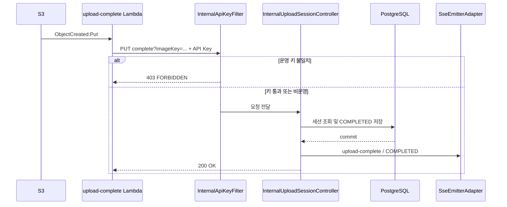

# API 명세 — 내부 API (Internal)

> 전체 인덱스: [`../api-spec.md`](../api-spec.md) · 이 문서가 내부 API 계약의 정본이다.
>
> 내부 API는 일반 앱 클라이언트용이 아니다. 현재 호출 주체는 S3 이벤트 Lambda 또는 운영자다.

---

## 1. 공통 보안 경계

### 운영 (`prod`)

- Spring Security의 `/internal/**` matcher 자체는 `permitAll`이다.
- 대신 `InternalApiKeyFilter`가 모든 `/internal/` 요청의 `X-Internal-Api-Key`를 검사한다.
- 헤더 값은 `internal.api-key`와 `MessageDigest.isEqual`로 비교한다.
- JWT는 요구하지 않는다.
- 키가 없거나 다르면 Controller까지 요청을 전달하지 않고 다음 응답을 반환한다.

```http
HTTP/1.1 403 Forbidden
Content-Type: application/json
```

```json
{
  "success": false,
  "data": null,
  "error": {
    "code": "FORBIDDEN",
    "message": "Invalid internal API key"
  }
}
```

이 오류는 공통 `ErrorCode`를 거치지 않으므로 `A003` 등의 표준 코드가 아니라 문자열
`FORBIDDEN`을 사용한다.

운영 설정은 다음 환경 변수를 요구한다.

```yaml
internal:
  api-key: ${INTERNAL_API_KEY}
```

Lambda의 `INTERNAL_API_KEY`와 백엔드의 `INTERNAL_API_KEY`는 같은 값이어야 한다.

### 비운영 (`!prod`)

- `DevSecurityConfig`는 `/internal/**`를 `permitAll`로 두고 `InternalApiKeyFilter`를 설치하지 않는다.
- 따라서 dev/test에서는 API 키 헤더가 없어도 내부 API를 호출할 수 있다.
- `firebase.enabled=true`를 비운영 환경에서 켜면 FCM 스모크 테스트도 API 키 없이 노출된다.
- 이 동작은 운영 보안 계약이 아니라 현재 비운영 편의 설정이다.

---

## 2. PUT /internal/upload-sessions/complete

S3 `PutObject` 이벤트를 받은 Lambda가 `imageKey`에 해당하는 업로드 세션을 완료한다.
DB 커밋 후 현재 연결된 SSE 구독자에게 `upload-complete: COMPLETED` 이벤트를 시도한다.

### 요청

```http
PUT /internal/upload-sessions/complete?imageKey=upload-sessions%2Fuser-id%2Fuuid.jpg HTTP/1.1
X-Internal-Api-Key: <internal-api-key>
Content-Type: application/json
```

Body는 없다.

| 위치 | 필드 | 타입 | 필수 | 설명 |
|---|---|---|---:|---|
| query | `imageKey` | string | 예 | S3 오브젝트 키. Lambda가 URL 인코딩해서 전달 |
| header | `X-Internal-Api-Key` | string | 운영에서 예 | 공통 내부 API 키 |

예시 imageKey:

```text
upload-sessions/{userId}/{uuid}.{extension}
```

### 처리 규칙

1. `imageKey`로 업로드 세션을 조회한다.
2. `PENDING`이면 `COMPLETED`로 바꾸고 저장한다.
3. 트랜잭션 커밋 후 세션 ID로 SSE 전송을 시도한다.
4. 현재 emitter가 없으면 SSE 전송은 조용히 종료하며 API 성공을 되돌리지 않는다.

이미 `COMPLETED`인 세션을 다시 호출하면 상태 변경 없이 `200 OK`다. 다만 서비스는 세션을 다시
저장하고 커밋 후 SSE 전송도 다시 시도한다. 따라서 **DB 상태 전이는 멱등이지만 부수 효과까지
정확히 한 번인 것은 아니다.**

`EXPIRED` 세션은 완료할 수 없다.

### 성공 응답 — 200 OK

```json
{
  "success": true,
  "data": null,
  "error": null
}
```

### 에러 응답

| HTTP | 코드 | 메시지 | 조건 |
|---|---|---|---|
| 400 | V014 | PENDING 상태의 세션만 처리할 수 있습니다. | 세션이 `EXPIRED` |
| 403 | FORBIDDEN | Invalid internal API key | 운영에서 내부 API 키 누락·불일치 |
| 404 | V004 | 업로드 세션을 찾을 수 없습니다. | `imageKey`에 해당하는 세션 없음 |

> **현행 입력 처리 공백:** `imageKey` 쿼리 파라미터를 누락하면 별도
> `MissingServletRequestParameterException` 처리가 없어 `500 C002`로 귀결될 수 있다.
> 이는 확정하려는 계약이 아니라 현재 코드에서 확인한 차이다.

---

## 3. POST /internal/fcm-test

Firebase 서비스 계정 키 로테이션·배포 직후 실제 단건 푸시를 보내 자격 증명과 전송 경로를
확인하는 운영용 스모크 테스트다. 이 요청은 인앱 알림을 저장하지 않고 사용자 FCM 토큰도
수정·삭제하지 않는다.

### 엔드포인트 등록 조건

- `firebase.enabled=true`: Controller와 실제 `FcmAdapter`가 등록된다.
- `firebase.enabled=false` 또는 속성 미설정: Controller가 등록되지 않아 경로를 사용할 수 없다.
- 운영 설정의 환경 변수 기본값은 `FIREBASE_ENABLED=false`다.

### 요청

```http
POST /internal/fcm-test?fcmToken=<url-encoded-token> HTTP/1.1
X-Internal-Api-Key: <internal-api-key>
```

Body는 없다.

| 위치 | 필드 | 타입 | 필수 | 설명 |
|---|---|---|---:|---|
| query | `fcmToken` | string | 예 | 실제 테스트 푸시를 받을 디바이스 토큰 |
| header | `X-Internal-Api-Key` | string | 운영에서 예 | 공통 내부 API 키 |

### 성공 형식 — 200 OK

이 API는 Firebase 발송 결과가 실패여도 처리된 점검 결과를 HTTP 200으로 반환한다.

```json
{
  "success": true,
  "data": {
    "sent": true,
    "status": "SUCCESS",
    "detail": "발송 성공"
  },
  "error": null
}
```

| 필드 | 타입 | nullable | 설명 |
|---|---|---:|---|
| `sent` | boolean | 아니오 | 실제 전송 성공 여부 |
| `status` | string | 아니오 | `SUCCESS`, `TOKEN_INVALID`, `ERROR` |
| `detail` | string | 아니오 | 결과 설명 또는 내부 오류 이름 |

### 결과 값

| `status` | `sent` | `detail` 예시 | 의미 |
|---|---:|---|---|
| `SUCCESS` | `true` | `발송 성공` | Firebase가 메시지를 접수함 |
| `TOKEN_INVALID` | `false` | `토큰 영구 무효(UNREGISTERED/INVALID_ARGUMENT)` | 자격 증명보다 대상 토큰 문제로 판정 |
| `ERROR` | `false` | `FCM_SEND_FAILED` | 재시도 대상 오류가 3회 시도 후에도 실패 |
| `ERROR` | `false` | `발송 실패` | 그 밖의 예외를 서비스가 포착 |

FCM 재시도는 최초 시도를 포함해 최대 3회이며 대기 시간은 1초, 2초로 증가한다.
`ERROR`도 `ApiResponse.success=true`와 HTTP 200으로 반환되므로 운영 점검은 HTTP 상태만 보지 말고
반드시 `data.sent`와 `data.status`를 확인해야 한다.

### HTTP 에러·미등록 상태

| HTTP | 코드 | 조건 |
|---|---|---|
| 403 | FORBIDDEN | 운영에서 내부 API 키 누락·불일치 |

> **현행 입력·보안 공백:** `fcmToken`에는 blank·길이 검증이 없고, 파라미터 누락은 별도 예외
> 처리 없이 `500 C002`가 될 수 있다. 또한 토큰을 query string으로 전달하므로 프록시·접근 로그
> 설정에 따라 민감한 토큰이 URL에 남을 수 있다.
>
> Controller 미등록 시 의도상 사용할 수 없는 경로지만, “항상 404”라는 프로젝트 계약을 보장하는
> 전용 핸들러·테스트는 없다. 현재 공통 `Exception` 핸들러가 미등록 경로 처리 예외까지 받으면
> `500 C002`가 될 수 있으므로 운영 확인이 필요하다.

---

## 4. Lambda 호출 경로



현재 저장소의 Lambda 동작은 다음과 같다.

- S3 이벤트 레코드를 순서대로 처리한다.
- `upload-sessions/`로 시작하지 않는 key는 건너뛴다.
- key를 디코딩한 뒤 query string에 다시 URL 인코딩한다.
- 백엔드 요청 timeout은 10초, Lambda timeout은 15초다.
- 백엔드 HTTP 오류와 연결 오류를 다시 던져 Lambda 호출을 실패시킨다.
- 배포 스크립트가 `s3:ObjectCreated:Put`과 `upload-sessions/` prefix를 버킷 알림에 설정한다.

---

## 5. 확인된 운영 경계

- SAM 템플릿에는 Lambda DLQ, 실패 Destination, 명시적 비동기 재시도 설정이 없다.
- 실제 AWS의 재시도·DLQ·경보 값은 저장소 밖 설정을 확인해야 한다.
- 배포 스크립트는 `put-bucket-notification-configuration`으로 버킷 알림 구성을 통째로 설정한다.
  같은 버킷에 다른 알림 구성이 있다면 보존되는지 배포 전에 확인해야 한다.
- 배포 스크립트는 내부 API 키를 명령행 인자로 받는다. 셸 히스토리·프로세스 인자 노출 정책을
  고려한 운영 비밀 주입 방식은 저장소에 별도로 구현되어 있지 않다.
- API 키는 단일 값 완전 일치 방식이며, 두 키를 동시에 허용하는 무중단 회전 절차는 없다.
- 네트워크 수준 접근 제한, WAF·rate limit 여부는 애플리케이션 저장소만으로 확인할 수 없다.
