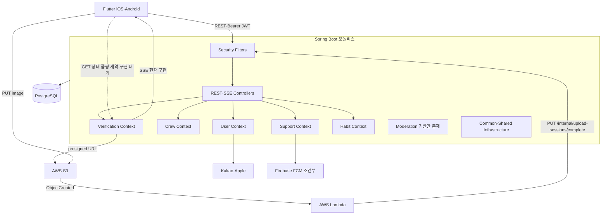
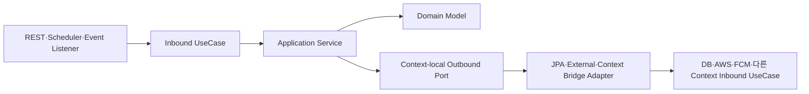
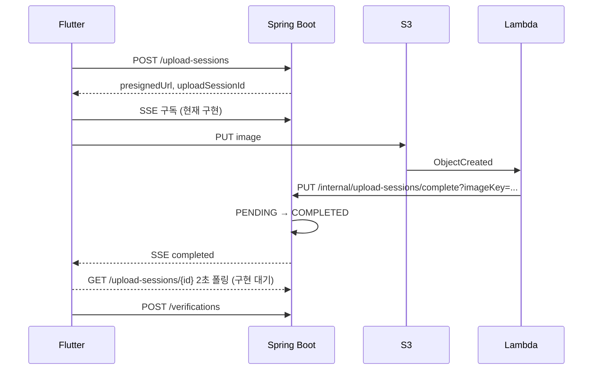

# Architecture — 현행 구조

> 이 문서는 저장소에 구현된 런타임·코드 경계를 설명한다. 비즈니스 규칙은
> [`biz-logic.md`](./biz-logic.md), 논리 관계와 물리 제약은 [`schema.md`](./schema.md),
> 컨텍스트 관계는 [`context-map.md`](./context-map.md)를 따른다.

---

## 1. 문서 표기 기준

| 표기 | 의미 |
|---|---|
| 현재 구현 | 저장소 코드와 설정에 존재하고 호출 경로가 연결됨 |
| 조건부 구현 | 코드가 있으나 설정값에 따라 NoOp 또는 비활성화됨 |
| 확정 계약·구현 대기 | 문서 계약은 확정됐지만 Java가 아직 따라오지 않음 |
| 기반만 존재 | Domain·Port·Adapter 일부만 있고 사용자 호출 경로가 없음 |

Redis, SQS, OpenAI Adapter는 현재 런타임 구성요소가 아니다. 도입 검토는
[`future-considerations.md`](../log/future-considerations.md)에서만 관리한다.

---

## 2. 런타임 구성



### 구성요소 상태

| 구성요소 | 현행 역할 |
|---|---|
| Spring Boot | 단일 배포 단위, REST·SSE·스케줄러·도메인 처리 |
| PostgreSQL | 모든 영속 데이터, Flyway가 운영 DDL 정본 |
| S3 | 사진 인증과 프로필 이미지 원본 저장 |
| Lambda | S3 ObjectCreated를 받아 내부 완료 API 호출 |
| FCM | `firebase.enabled=true`일 때 활성, false면 NoOp Adapter |
| Kakao·Apple | 소셜 사용자 검증, Apple token 교환·revoke |

운영 AWS의 실제 S3 이벤트 필터, Lambda retry·DLQ, IAM, 경보 값은 저장소 밖 설정 확인이 필요하다.

---

## 3. 컨텍스트와 구현 상태

| 영역 | 상태 | 책임 |
|---|---|---|
| User | 현재 구현 | 소셜 인증, JWT, 프로필, 탈퇴·재가입 |
| Crew | 현재 구현 | 크루·멤버십·챌린지, 검색, 가입 동시성 |
| Verification | 현재 구현 | 업로드 세션, 크루 인증, 피드, SSE |
| Support | 현재 구현 | 알림, FCM, 인증 리액션 |
| Habit | 현재 구현 | 솔로 습관·작심 사이클·인증 |
| Moderation | 기반만 존재 | Report·Review 모델, JPA Adapter, Crew·Verification Client Adapter |
| Common | Shared Infrastructure | 보안, 응답, 예외, StoragePort, Dead Letter, ChunkProcessor |

Moderation에는 현재 `api/`, `application/`, Inbound UseCase가 없다. 따라서 신고·검토는 사용자 API로
연결되지 않은 기반 코드다.

---

## 4. 실제 패키지 구조

```text
com.triagain
├── user/
├── crew/
├── verification/
├── support/
├── habit/
├── moderation/
└── common/

com.triagain.{context}
├── api/           # REST Controller와 API DTO
├── application/   # Inbound UseCase 구현과 orchestration
├── domain/
│   ├── model/     # Aggregate·Entity
│   └── vo/        # Enum·Value Object
├── port/
│   ├── in/        # 외부가 호출하는 UseCase
│   └── out/       # 저장소·외부 시스템·타 컨텍스트 요구사항
└── infra/         # JPA·외부 API·타 컨텍스트 브리지 Adapter
```

- 실제 루트 패키지는 `com.triagain`이다.
- 모든 컨텍스트가 모든 하위 폴더를 갖는 것은 아니다. Moderation은 api/application/port-in이 없다.
- `common`은 Bounded Context가 아니라 여러 컨텍스트가 공유하는 기술 인프라다.

---

## 5. 헥사고날 경계



### 현재 지키는 원칙

- Domain은 Spring, JPA, AWS SDK에 의존하지 않는다.
- Application은 자기 컨텍스트의 Port와 Domain을 중심으로 orchestration한다.
- JPA Entity와 Repository는 infra에 둔다.
- Aggregate 간 영속 참조는 객체 연관 대신 ID로 저장한다.
- 외부 API 호출은 Port 뒤에 둔다.

### 현재 예외와 경계 부채

대부분의 컨텍스트 브리지는 소비 컨텍스트의 Outbound Port를 Adapter가 구현하고 제공 컨텍스트의
Inbound UseCase를 호출한다. 그러나 알림 연결은 이 패턴을 따르지 않는다.

- `crew.infra.NotificationAdapter`가 Support Domain·Outbound Port와 UserRepositoryPort를 직접 사용한다.
- `verification.infra.VerificationNotificationAdapter`도 Support Domain·Outbound Port와
  UserRepositoryPort를 직접 사용한다.
- 두 Adapter는 단순 변환을 넘어 알림 생성·저장·FCM orchestration까지 수행한다.

따라서 기존 문서의 “컨텍스트 간 직접 의존이 전혀 없다”는 설명은 사실이 아니다. Domain Core의
인프라 역의존은 막고 있지만 Adapter 계층에는 타 컨텍스트 컴파일 의존이 존재한다.

---

## 6. 컨텍스트 간 통신

### 동기 Port·Adapter 브리지

| 소비 컨텍스트 | 자기 Outbound Port | Bridge Adapter가 호출하는 제공 Context |
|---|---|---|
| Crew | `UserPort` | User `UserProfileQueryUseCase` |
| Crew | `VerificationQueryPort` | Verification 조회 UseCase |
| Verification | `ChallengePort`, `CrewPort` | Crew 조회 UseCase |
| Verification | `HabitPort` | Habit `ValidateHabitUploadAccessUseCase` |
| Verification | `ReactionPort` | Support `GetReactionSummariesUseCase` |
| Habit | `HabitUploadSessionPort` | Verification `UploadSessionQueryUseCase` |
| Support | `CrewMembershipPort` | Crew `CrewMembershipQueryUseCase` |
| Moderation | `CrewPort`, `VerificationPort` | Crew·Verification 조회 UseCase |
| User | `CrewMembershipPort` | Crew가 구현한 탈퇴 정리 Adapter |

현재 패키지 컴파일 의존은 Crew↔Verification, Verification↔Habit, Crew↔Support처럼 양방향이 존재한다.
런타임 호출이 무조건 순환한다는 뜻은 아니지만, 모듈 분리 시 그대로는 단방향 의존 그래프가 되지 않는다.

### 이벤트

| 이벤트 | 상태 | 처리 |
|---|---|---|
| `CrewFirstVerificationEvent` | 활성 | 커밋 후 비동기 리스너가 첫 인증 알림 fan-out |
| `ChallengeSuccessEvent` | 발행만 함 | 리스너 메서드가 주석 처리되어 현재 알림 미발송 |

Spring ApplicationEvent는 현재 프로세스 안에서만 동작하며 메시지 브로커 전달 보장은 없다.

---

## 7. 보안 경계

### 운영 (`prod`)

| 경로 | 인증 처리 |
|---|---|
| `/auth/**` | `permitAll`; 로그인·가입·refresh·no-op logout |
| `/internal/**` | Security matcher는 permitAll이지만 `InternalApiKeyFilter`가 `X-Internal-Api-Key` 검증 |
| `/upload-sessions/*/events` | 현재 permitAll |
| `/crews/search`, `/invite/**`, health·정적 경로 | permitAll |
| 나머지 | Bearer Access JWT + DB `tokenVersion` 검증 |

### 비운영 (`!prod`)

- JWT 인증 뒤 `X-User-Id` fallback Filter를 추가한다.
- `/internal/**`에는 운영용 InternalApiKeyFilter를 설치하지 않는다.
- 따라서 비운영 인증 동작을 운영 계약으로 간주하면 안 된다.

### 확정 계약과 구현 공백

- `GET /upload-sessions/{id}`는 JWT 인증·소유자 전용 계약이 확정됐지만 Controller 구현이 없다.
- SSE도 JWT 인증·소유자 전용으로 계약을 바꿨지만 현재 Security와 Controller는 적용 전이다.
- `SseEmitterAdapter`는 `Map<sessionId, emitter>` 하나만 저장하므로 같은 세션의 재연결·다중 연결이
  이전 emitter를 덮어쓴다.

---

## 8. 사진 업로드 완료 흐름



- Lambda 요청은 운영에서 Internal API Key를 포함해야 한다.
- Lambda 완료 처리는 imageKey로 세션을 조회한다.
- 클라이언트 계약은 SSE와 2초 폴링을 병행하고 최대 90초 동안 먼저 완료된 결과를 채택한다.
- 상세 운영 경계는 [`photo-upload-lambda-sse.md`](./photo-upload-lambda-sse.md)를 따른다.

---

## 9. 영속성·트랜잭션·배치

- 운영 DDL은 Flyway가 관리하고 JPA는 런타임 매핑에 사용한다.
- DB에 물리 FK가 없으므로 삭제 순서와 정합성은 서비스·명시적 쿼리가 책임진다.
- 가입·인증 중복은 조건부 UPDATE와 DB 유니크 제약을 사용한다.
- 외부 FCM 호출은 핵심 DB 결과를 롤백하지 않는 best-effort 정책이다.
- 첫 인증 알림은 AFTER_COMMIT + 비동기 executor로 처리한다.
- ChallengeSuccessEvent 리스너는 현재 비활성이다.
- 스케줄러는 ChunkProcessor로 50건 단위 트랜잭션을 사용하고 최종 실패를 Dead Letter로 남긴다.
- 서버 시작 보정 Runner가 밀린 크루·챌린지·업로드 세션·습관 사이클 상태를 복구한다.

---

## 10. 현재 확인이 필요한 경계

| 항목 | 현재 사실 | 후속 판단 |
|---|---|---|
| 알림 Adapter BC 의존 | Crew·Verification infra가 Support 내부 타입과 Port를 직접 사용 | Support Inbound UseCase·이벤트 경계로 옮길지 별도 분석 |
| 패키지 의존 순환 | 세 쌍 이상의 양방향 컴파일 의존 존재 | 모듈 분리 필요 시 방향 재설계 |
| Moderation | 기반 코드만 있고 사용자 호출 경로 없음 | 기능 착수 시 현재 Adapter 경계부터 재검증 |
| SSE | 공개·소유권 미검증·단일 emitter | 확정 API 계약에 맞춰 구현 |
| 폴링 | 계약만 있고 Controller 없음 | 상태 조회 API 구현 |
| FCM | 코드 존재, 환경 설정에 따라 NoOp | 운영 `FIREBASE_ENABLED`와 자격증명 확인 |
| AWS 운영 | retry·DLQ·경보 값을 저장소에서 확정 불가 | 배포 환경에서 확인 |

상세 후속 과제는 [`future-considerations.md`](../log/future-considerations.md)에 기록한다.
