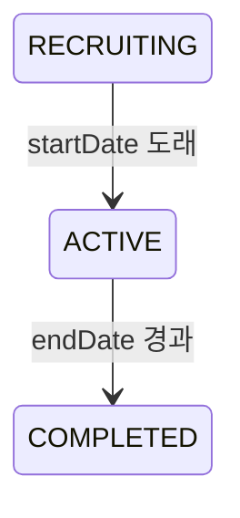

# 비즈니스 규칙 — 현행

> 이 문서는 현재 구현된 도메인 규칙의 요약 정본이다. 요청·응답·에러 계약은
> [`api-spec/`](./api-spec.md), 물리 제약은 [`schema.md`](./schema.md), 구현 경계는
> [`architecture.md`](./architecture.md)를 따른다.

---

## 1. 크루

상세 API 계약: [`api-spec/crew.md`](./api-spec/crew.md)

### 1.1 생성

| 항목 | 현행 규칙 |
|---|---|
| 이름 | 필수, 최대 50자 |
| 목표 | 필수, 최대 500자 |
| 인증 내용 | 필수, 최대 50자 |
| 인증 방식 | `TEXT` 또는 `PHOTO` |
| 최대 인원 | 백엔드 1~10명, 제품 UI 2~10명 |
| 시작일 | 오늘보다 이후 |
| 종료일 | 시작일보다 이후이며 최소 `startDate + 6일` |
| 최대 기간 | `endDate - startDate <= crew.max-duration-days`, 기본 30일 |
| 마감 시각 | 미입력 시 23:59:59 |
| 카테고리 | `EXERCISE`, `STUDY`, `LIFESTYLE`, `SELF_DEV`, `ETC` 중 필수 |
| 공개 범위 | `PUBLIC` 또는 `PRIVATE`, 미입력 시 `PRIVATE` |
| 중간 가입 | 크루장이 `allowLateJoin`으로 결정 |

- 생성자는 LEADER 멤버로 자동 등록되며 `currentMembers=1`이다.
- 초대 코드는 혼동 문자를 제외한 6자리 영숫자로 생성한다.
- 최초 상태는 `RECRUITING`이다.

### 1.2 가입

| 경로 | 조건 |
|---|---|
| 초대 코드 가입 | 공개 여부와 무관하게 유효한 초대 코드 사용 |
| 공개 크루 직접 가입 | `PUBLIC` 크루만 허용 |

공통 규칙:

- `RECRUITING`은 가입할 수 있다.
- `ACTIVE`는 `allowLateJoin=true`일 때만 가입할 수 있다.
- 오늘이 `endDate - 3일`보다 늦으면 가입할 수 없다.
- 정원이 차거나 이미 가입한 사용자는 거부한다.
- 가입 역할은 MEMBER다.

기본 동시성 전략은 `CONDITIONAL`이다.

- 정원은 `current_members < max_members` 조건부 원자적 UPDATE로 보호한다.
- 중복 가입은 `(crew_id, user_id)` 유니크 제약으로 보호한다.
- 조건부 전략은 재시도하지 않는다.
- 설정으로 `PESSIMISTIC`, `OPTIMISTIC` 전략을 선택할 수 있다.
- 낙관적 전략은 `version`과 최대 3회 재시도를 사용한다.

상세 순서: [`sequence/crew-join.md`](./sequence/crew-join.md)

### 1.3 검색·조회

- 내 크루 목록, 크루 상세, 피드, 초대 미리보기를 제공한다.
- 공개 검색은 인증 없이 허용한다.
- 검색 대상은 `PUBLIC`이면서 다음 중 하나다.
  - `RECRUITING`
  - `ACTIVE`, `allowLateJoin=true`, `endDate >= 오늘 + minRemainingDays`
- `minRemainingDays` 기본값은 6일이다.
- 이름·목표 키워드와 카테고리로 필터링하고 `createdAt DESC`로 정렬한다.
- 기본 20건, 최대 50건이며 `hasNext`를 반환한다.

### 1.4 수정·삭제·탈퇴

수정:

- LEADER만 `RECRUITING` 상태에서 수정할 수 있다.
- 수정 가능 필드는 name, goal, verificationContent, category, visibility다.
- PATCH 요청은 최소 한 필드가 필요하며 blank 문자열은 거부한다.

삭제:

- LEADER만 요청할 수 있다.
- `RECRUITING`, 또는 챌린지가 한 번도 생성되지 않은 `ACTIVE` 크루만 삭제할 수 있다.
- LEADER 혼자 남은 크루만 삭제할 수 있다.
- 상태·챌린지 가드를 멤버 수 가드보다 먼저 판정한다.
- 삭제는 hard delete이며 연관 데이터를 서비스가 leaf-to-root 순서로 명시적으로 제거한다.

멤버 탈퇴:

- MEMBER만 일반 탈퇴 API를 사용할 수 있다.
- `RECRUITING`에서는 탈퇴할 수 있다.
- `ACTIVE`에서는 해당 사용자·크루의 챌린지 이력이 전혀 없을 때만 탈퇴할 수 있다.
- `COMPLETED`이거나 챌린지 이력이 있으면 거부한다.
- 탈퇴 시 멤버 행을 삭제하고 `currentMembers`를 감소시킨다.

### 1.5 상태와 챌린지



- 크루 활성화는 매일 00:00, 종료는 매일 00:05 스케줄러가 처리한다.
- 챌린지는 첫 인증 요청 때 사용자·크루별로 lazy 생성한다.
- 챌린지는 3일 사이클이며 매일 유효 인증 시 `completedDays`가 증가한다.
- 3일을 채우면 `SUCCESS`, 마감과 grace를 넘기면 `FAILED`가 된다.
- 실패 후 다음 인증에서 새 챌린지를 생성한다.
- 크루가 종료되면 진행 중 챌린지는 `ENDED`가 된다.

---

## 2. 크루 인증

상세 API 계약: [`api-spec/verification.md`](./api-spec/verification.md)

상세 순서: [`sequence/verification.md`](./sequence/verification.md)

### 2.1 인증 방식

| 방식 | 필수 | 선택 |
|---|---|---|
| `TEXT` | textContent | 없음 |
| `PHOTO` | 완료된 uploadSessionId | textContent |

- 새 인증 상태는 `APPROVED`, reviewStatus는 `NOT_REQUIRED`, reportCount는 0이다.
- 유효 슬롯은 `APPROVED`만이 아니라 `status != CANCELLED`인 인증 전체가 점유한다.

### 2.2 업로드 세션

- 업로드 세션은 `crewId` 또는 `habitId` 중 정확히 하나에 바인딩한다.
- 확정 계약은 요청 사용자 소유이며 다른 크루·습관에서 교차 사용할 수 없다는 것이다.
- 현재 Crew 인증 검증은 `crewId`가 null인 Habit 세션을 거부하지 않아 Habit → Crew 교차 사용이
  가능하고, 서로 다른 두 인증 테이블에서 같은 세션을 한 번씩 소비할 수 있는 구현 공백이 있다.
- presigned URL과 PENDING 세션을 만들고 S3 업로드 완료 후 Lambda가 내부 API로 COMPLETED 처리한다.
- PENDING 세션은 15분이 지나면 5분 주기 스케줄러가 EXPIRED 처리한다.
- 사진 인증 생성에는 COMPLETED 세션만 사용할 수 있다.
- `verification.upload_session_id` 유니크 제약이 세션 재사용을 차단한다.
- 상세 완료 확인은 SSE와 2초 폴링 fallback 계약을 따른다.
- GET 상태 조회와 SSE 인증·소유권 검증은 확정 계약이며 현재 백엔드 구현은 아직 따라오지 않았다.

현재 서버에는 S3 Circuit Breaker나 장애 시 1시간 추가 유예 정책이 없다. 인증 유효창은 아래 마감
정책 하나를 사용한다.

### 2.3 슬롯과 마감

- 슬롯은 `challenge.startDate + challenge.completedDays`다.
- 저장하는 `targetDate`는 요청 처리 날짜가 아니라 슬롯 날짜다.
- 텍스트 인증의 기준 시각은 서버가 요청을 처리한 시각이다.
- 사진 인증의 기준 시각은 서버가 기록한 `upload_session.requestedAt`이다.
- 슬롯 유효 상한은 다음 값이다.

```text
min(슬롯 날짜의 crew.deadlineTime, challenge.deadline) + grace 5분
```

- 기준 시각이 슬롯보다 이르면 이미 채운 슬롯을 선제 제출하려는 요청으로 보고 중복 인증 처리한다.
- 같은 사용자·크루·targetDate에는 `CANCELLED`가 아닌 인증을 최대 하나만 허용한다.
- 슬롯당 전체 제출 회차는 CANCELLED 이력을 포함하여 기본 3회까지다.

### 2.4 취소와 수정

| 연산 | 허용 상한 | 결과 |
|---|---|---|
| 생성 | 슬롯 유효 상한 + grace 5분 | 새 인증 생성, challenge 진행도 증가 |
| 수정 | 슬롯 유효 상한 | 기존 행 CANCELLED + 새 행 생성, challenge 진행도 불변 |
| 취소 | 슬롯 유효 상한 - 5분 | 기존 행 CANCELLED, challenge 진행도 감소 |

공통 가드:

- 본인 인증만 변경할 수 있다.
- moderation 대상 인증은 변경할 수 없다.
- 슬롯 제출 상한에 도달하면 변경할 수 없다.
- 판정 시각은 서비스 진입 시 한 번만 읽는다.

취소:

- 이미 CANCELLED인 인증의 재요청은 200으로 멱등 처리한다.
- `completedDays`를 1 감소시키고 `SUCCESS`였으면 `IN_PROGRESS`로 되돌린다.
- 취소 후 재인증하지 않고 마감을 넘기면 해당 챌린지는 실패할 수 있다.

수정:

- in-place UPDATE가 아니라 새 verificationId를 만드는 치환이다.
- 기존 인증은 CANCELLED가 되고 새 인증의 slotAttempt는 증가한다.
- PHOTO 인증의 텍스트만 수정하면 기존 imageUrl을 승계한다.
- 사진을 바꾸려면 같은 크루에 바인딩된 새 COMPLETED 업로드 세션이 필요하다.
- 기존 인증의 신고·반응은 새 행으로 이전하지 않는다.

### 2.5 리액션

- 현재 API가 허용하는 이모지는 `LIKE` 하나다.
- 사용자별 인증 하나에 반응 하나를 저장하며 PUT 재요청은 이모지를 교체한다.
- `createdAt`은 최초 반응 시각을 유지한다.
- 해당 크루의 현재 멤버만 PUT·DELETE할 수 있으며 본인 인증에도 반응할 수 있다.
- 마감·날짜·크루 상태 제한은 없다. 피드에 접근 가능한 인증이면 반응할 수 있다.
- 취소된 인증과 그 반응은 DB에 남지만 피드에서는 노출하지 않는다.
- 회원탈퇴 시 반응은 익명화된 사용자 이력으로 남는다.
- 리액션 알림은 발송하지 않는다.

---

## 3. 사용자

상세 현행: [`user.md`](./user.md)

API 계약: [`api-spec/auth-user.md`](./api-spec/auth-user.md)

- 카카오·Apple 모두 로그인과 회원가입이 분리되어 있다.
- 신규·탈퇴 사용자는 로그인 API에서 생성되지 않고 가입용 정보만 받는다.
- 가입·재가입 성공 시 Access·Refresh JWT를 발급한다.
- 회원탈퇴는 soft delete, 개인정보 초기화, 크루 정리, `tokenVersion` 증가를 수행한다.
- Apple 사용자는 저장된 refresh token이 있으면 트랜잭션 밖에서 revoke를 시도한다.
- Apple revoke 실패는 탈퇴를 막지 않는다.
- 동일 소셜 계정 재가입은 기존 탈퇴 행을 재활성화한다.
- 프로필 이미지는 presigned URL로 직접 업로드하고 별도 PATCH로 URL을 확정한다.

---

## 4. 알림

상세 API 계약: [`api-spec/notification.md`](./api-spec/notification.md)

- 현재 실제 생성 경로가 활성화된 타입은 `CREW_STARTED`, `REMINDER`, `CREW_FIRST_VERIFICATION`이다.
  `CHALLENGE_SUCCESS` 리스너와 `CHALLENGE_FAILED` Port 호출은 주석 처리되어 현재 발송하지 않는다.
- 인앱 알림을 먼저 저장하고 FCM은 best-effort로 발송한다.
- FCM 실패는 저장된 인앱 알림을 롤백하지 않는다.
- 무효 FCM 토큰 응답을 받으면 사용자 토큰을 비운다.
- 목록 조회는 읽음 필터와 페이지네이션을 지원한다.
- 전체 읽음과 전체 삭제는 대상이 0건이어도 200으로 멱등 처리한다.

스케줄 알림:

| 종류 | 현행 규칙 |
|---|---|
| 크루 시작 | 매일 09:00, startDate가 오늘인 크루의 멤버 대상 |
| 마감 리마인더 | 매 15분, 마감 15~30분 전 미인증자 대상 |
| 챌린지 성공 | 이벤트는 발행하지만 리스너 비활성으로 현재 미발송 |
| 챌린지 실패 | 실패 전이는 수행하지만 알림 Port 호출이 비활성이라 현재 미발송 |
| 크루 첫 인증 | 오늘 첫 인증자를 제외한 ACTIVE 멤버에게 발송 |

크루 첫 인증 알림:

- 운영 기본값은 ON이다.
- `[08:00, 22:00)` 사이에서만 보낸다.
- 같은 크루·targetDate의 기존 알림 존재 여부로 중복 fan-out을 막는다.
- 동시 첫 인증에서는 이벤트가 둘 이상 발행될 수 있으며 리스너의 존재 확인이 best-effort 최종 방어다.

---

## 5. 습관 — 솔로 모드

상세 설계 정본: [`sdd/solo-habit/step1-biz-logic.md`](../../../sdd/solo-habit/step1-biz-logic.md)

API 계약: [`api-spec/habit.md`](./api-spec/habit.md)

### 5.1 습관

- 사용자는 여러 습관을 등록할 수 있으며 현재 개수 상한은 없다.
- 상태는 `ACTIVE`, `PAUSED`, `ENDED`다.
- TEXT/PHOTO 인증 방식은 생성 후 변경하지 않는다.
- verificationContent는 선택이며 최대 100자, blank는 null로 정규화한다.
- 습관 생성만으로 사이클을 시작하지 않는다.
- IN_PROGRESS 사이클이 없을 때만 PAUSED로 전환할 수 있다.
- ENDED는 터미널 상태이며 재개할 수 없다.
- 종료 시 진행 중 사이클이 있으면 같은 트랜잭션에서 FAILED 처리한다.

### 5.2 사이클

- 3일 단위이며 상태는 `IN_PROGRESS`, `SUCCESS`, `FAILED`다.
- 시작 옵션은 TODAY 또는 TOMORROW이고 기본값은 TODAY다.
- TODAY는 오늘 마감+grace 이내이며 오늘 인증 이력이 없어야 한다.
- TOMORROW는 다음 날 시작으로 예약한다.
- 시작일 전 예약 사이클만 취소할 수 있다.
- 순차 중복 시작은 `HB002`로 거부한다.
- 동시 생성 유니크 충돌은 기존 IN_PROGRESS 사이클을 반환할 수 있다.
- 3일을 채우면 SUCCESS, 마감과 grace를 넘기면 FAILED가 된다.
- 실패 후 재도전은 사용자가 새 사이클을 직접 시작한다.

### 5.3 인증

- 인증 날짜는 반드시 `cycle.startDate + completedDays`와 오늘이 같아야 한다.
- 이 가드 때문에 솔로 모드는 자정을 넘긴 전날 슬롯 제출을 허용하지 않는다.
- TEXT는 현재 시각, PHOTO는 세션 requestedAt으로 마감을 판정한다.
- PHOTO 세션은 사용자 소유, `crewId=null`, 요청 habitId 일치, COMPLETED여야 한다.
- 습관·targetDate별 인증 하나와 uploadSessionId 1회 사용을 DB 제약으로 보장한다.
- 인증 성공 시 completedDays가 증가하고 3회면 SUCCESS가 된다.
- 솔로 모드에는 피드·리액션·신고·검토가 없다.

모든 습관 변경 서비스는 habit 행을 비관적으로 잠가 시작·멈춤·종료·인증의 자기 경합을 직렬화한다.

---

## 6. 스케줄러 복원력

현재 배치 스케줄러는 50건 ChunkProcessor를 사용한다.

1. 전체 대상을 조회한다.
2. 50건 단위 트랜잭션으로 처리한다.
3. 청크 실패 시 건별 트랜잭션으로 재시도하며, 도메인 변이 작업은 fresh entity를 재조회한다.
4. 건별 재시도도 실패하면 Dead Letter를 저장한다.

| 작업 | 실행 주기 |
|---|---|
| 크루 활성화 | 매일 00:00 |
| 크루 종료 | 매일 00:05 |
| 크루 챌린지 실패 | 5분 간격 |
| 업로드 세션 만료 | 5분 간격 |
| 솔로 사이클 실패 | 5분 간격 |
| 크루 시작 알림 | 매일 09:00 |
| 마감 리마인더 | 매 15분 |

- 만료·실패 대상은 한 번의 스케줄 지연으로 영구 누락되지 않도록 현재 전체 미처리 건을 조회한다.
- 서버 시작 시 Crew 보정 러너가 우선 실행되고 Verification·Habit 보정 러너는 같은 `@Order(2)`다.
- 한 보정 단계 실패가 다음 단계 실행을 막지 않는다.
- Dead Letter는 PENDING으로 생성되고 10분 뒤 재시도 가능 상태가 된다.
- retryCount는 최대 3이며 재시도 간격은 `10 * 2^retryCount`분이다.
- 최대 횟수 도달 시 ABANDONED, 수동 해결 시 RESOLVED다.

---

## 7. 현재 일관성·실패 정책

- 크루 정원은 조건부 UPDATE, 중복 가입은 DB 유니크 제약으로 보호한다.
- 크루 인증 중복은 사전 조회와 `status != CANCELLED` 부분 유니크 인덱스로 보호한다.
- 인증 업로드 세션과 솔로 업로드 세션은 각각 유니크 제약으로 1회 사용을 보호한다.
- 인증 API는 Idempotency-Key나 분산 락을 사용하지 않는다.
- 인증 커밋 후 응답만 유실되면 재요청은 기존 성공 응답을 재사용하지 않고 중복 오류를 반환한다.
- S3 업로드 후 인증 트랜잭션이 실패하면 COMPLETED 세션은 유지되어 영구 오류가 아닌 경우 재시도할 수 있다.
- 저장소에는 S3 Circuit Breaker, 1시간 장애 유예, 서버 측 업로드 큐가 구현되어 있지 않다.
- Moderation은 도메인·테이블·어댑터 일부만 있고 Controller와 Application UseCase가 없어 현재 사용자 API가 아니다.

향후 로드맵과 미구현 개선은 [`future-considerations.md`](../log/future-considerations.md)에만 기록한다.

---

## 8. 현재 설계 트레이드오프

아래는 미구현 계획이 아니라 현재 코드가 의도적으로 선택한 방식과 그 비용이다.

| 주제 | 현재 선택 | 얻는 것 | 감수한 비용·재검토 조건 |
|---|---|---|---|
| 크루 가입 동시성 | 조건부 원자적 UPDATE + 멤버 유니크 제약 | 재시도 없이 정원·중복 가입 보호, 낮은 p95 | 가입 규칙이 복잡해져 단일 UPDATE로 표현하기 어려워지면 전략 재검토 |
| 인증 중복 | 사전 조회 + 조건부 유니크 인덱스 | 분산 락 없이 유효 인증 1건 보장 | 중복 요청에 기존 성공 응답을 재사용하지 못함 |
| API 멱등성 | Idempotency-Key 미사용 | Redis·키 저장소·응답 보관 불필요 | 응답 유실 후 재요청은 V003/V015 등 중복 오류가 됨 |
| 사진 업로드 | S3 직접 업로드 + Lambda 완료 처리 | 애플리케이션 서버의 파일 트래픽과 메모리 사용 감소 | S3·Lambda·내부 API 운영 상태에 의존, 완료 확인 fallback 필요 |
| 완료 알림 계약 | SSE와 2초 폴링 병행 | SSE 연결 실패·유실 시에도 완료 확인 가능 | 중복 조회 트래픽과 두 경로의 유지 비용 발생, 현재 백엔드 구현 공백 존재 |
| 장애 유예 | 추가 1시간 유예 없이 공통 5분 grace 사용 | 텍스트·사진·스케줄러 마감 규칙 일치 | 장기 S3 장애를 흡수하지 못하며 사용자가 인증에 실패할 수 있음 |
| JWT 갱신 | Stateless Refresh Token, rotation·서버 저장 없음 | 서버 저장소 없이 단순 운영 | 개별 Refresh Token 폐기 불가, 탈퇴·재가입의 tokenVersion 단위로만 무효화 |
| 로그아웃 | 클라이언트 토큰 삭제, 서버 no-op | 블랙리스트와 추가 DB 쓰기 불필요 | 유출된 토큰은 만료·tokenVersion 변경 전까지 유효 |
| Apple 탈퇴 | refresh token 암호화 저장 후 revoke best-effort | Apple 연결 해제를 시도하면서 외부 장애가 탈퇴를 막지 않음 | revoke 실패 시 Apple 측 연결이 남을 수 있음 |
| 알림 | 인앱 저장 후 FCM best-effort | 푸시 장애가 핵심 트랜잭션을 롤백하지 않음 | 푸시 전달 보장·재시도 보장 없음 |
| 첫 인증 알림 | 이벤트 중복 가능 + 저장 이력 존재 확인 | 인증 트랜잭션과 fan-out 분리 | 동시 race를 DB 유니크로 완전히 차단하지 않아 중복 가능성이 남음 |
| 스케줄러 조회 | 미처리 전량 조회 + 50건 청크 | 배포·GC pause로 한 틱을 놓쳐도 다음 실행에서 복구 | 데이터가 커지면 전량 조회 비용 증가 |
| DB 관계 | 물리 FK 없이 논리 참조 | 컨텍스트별 삭제·쓰기 순서 유연성 | orphan을 DB가 막지 못해 서비스 삭제 경로와 정합성 테스트가 중요 |
| 솔로 습관 모델 | Crew Challenge를 재사용하지 않고 경량 복제 | 크루 규칙과 다른 PAUSED·명시적 시작·자정 hard cut을 독립적으로 표현 | 유사 마감·사이클 로직을 두 컨텍스트에서 동기화해야 함 |

재검토 조건의 상세 후보와 우선순위는 이 문서가 아니라
[`future-considerations.md`](../log/future-considerations.md)에서 관리한다.
