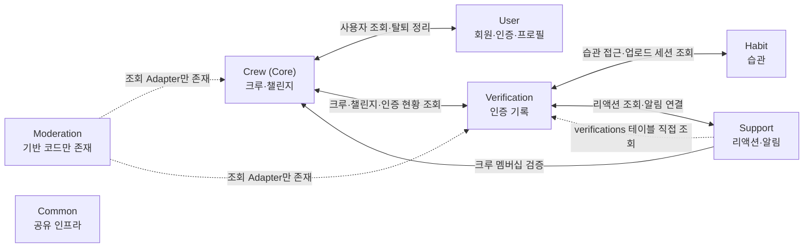

# Context Map - 바운디드 컨텍스트 관계도

> 이 문서는 현재 코드의 컨텍스트 책임과 통신 경계를 설명한다.
> 목표 구조와 후속 개선안은 [architecture.md](./architecture.md)와
> [future-considerations.md](../log/future-considerations.md)를 따른다.

## 1. 현재 컨텍스트 지도

- **활성 컨텍스트:** User, Crew, Verification, Habit, Support
- **핵심 컨텍스트:** Crew
- **기반만 존재:** Moderation은 Domain·Repository·조회 Adapter 일부만 있으며,
  Controller와 입력 UseCase가 없어 사용자 기능으로 연결되지 않는다.
- **공유 영역:** Common은 바운디드 컨텍스트가 아니라 보안, 예외 처리, JPA 감사,
  S3, FCM 등 여러 컨텍스트가 함께 사용하는 인프라다.

## 2. 컨텍스트별 책임

| 컨텍스트 | 현재 책임 | 대표 모델 |
|---|---|---|
| User | 카카오·애플 로그인, JWT, 프로필, 탈퇴·재가입, FCM 토큰 | `User` |
| Crew | 크루 생성·가입·탈퇴, 멤버 관리, 3일 챌린지와 참여 상태 | `Crew`, `CrewMember`, `Challenge`, `ChallengeParticipant` |
| Verification | 텍스트·사진 인증 생성, 조회, 리액션 요약 연결, **업로드 세션 소유**(생성·완료·만료·SSE) | `Verification`, `UploadSession` |
| Habit | 사용자 습관 | `Habit` |
| Support | 리액션 등록·취소·조회, FCM 알림 연결 | `Reaction` 및 알림 Adapter |
| Moderation | 신고·검토 도메인과 저장소 기반 | `Report`, `Review` |

## 3. 실제 동기 통신

컨텍스트 간 호출은 별도 서비스 API가 아니라 같은 Spring 애플리케이션 안의 Java 호출이다.
대부분 소비 컨텍스트의 출력 Port를 Adapter가 구현하고, 제공 컨텍스트의 입력 UseCase를 호출한다.

| 소비 컨텍스트 | 로컬 Port / Adapter | 제공 컨텍스트 | 현재 용도 |
|---|---|---|---|
| Crew | `UserPort` | User | 크루 응답에 필요한 사용자 프로필 조회 |
| User | `CrewMembershipPort` | Crew | 회원 탈퇴 전 크루장 여부 확인 및 멤버십 정리 |
| Verification | `CrewPort`, `ChallengePort` | Crew | 멤버십·챌린지·인증 가능 여부 조회 |
| Crew | `VerificationQueryPort` | Verification | 오늘 인증 여부와 승인 일수 조회 |
| Verification | `HabitPort` | Habit | 사진 인증 대상 습관 접근 확인 |
| Habit | `HabitUploadSessionPort` | Verification | 업로드 세션 기준 인증 상태 조회 |
| Verification | `ReactionPort` | Support | 인증별 리액션 요약 조회 |
| Support | `CrewMembershipPort` | Crew | 리액션 요청자의 크루 멤버십 확인 |
| Moderation | `CrewPort`, `VerificationPort` Adapter | Crew, Verification | 신고·검토 기반 조회. 현재 입력 기능에서는 호출되지 않음 |

## 4. 이벤트와 알림

| 이벤트 | 발행 | 소비 | 현재 상태 |
|---|---|---|---|
| `CrewFirstVerificationEvent` | Verification | Support 알림 Listener | 활성. 트랜잭션 커밋 후 비동기 처리 |
| `ChallengeSuccessEvent` | Verification | Support 알림 Listener | 이벤트는 발행하지만 Listener 메서드가 주석 처리되어 알림은 보내지 않음 |

현재 `ReviewCompletedEvent`는 존재하지 않으며 Moderation에서 Support로 이어지는 운영 흐름도 없다.
이 이벤트들은 프로세스 내부 Spring 이벤트이므로 외부 메시지 브로커 기반 비동기 통신은 아니다.

## 5. 현재 경계 예외

아래 항목은 현재 동작을 사실대로 적은 것이며, 권장 구조를 뜻하지 않는다.

1. `Support.VerificationLookupAdapter`는 입력 UseCase를 거치지 않고 네이티브 SQL로
   `verifications` 테이블의 `crew_id`를 조회한다.
2. Crew와 Verification의 알림 Adapter는 Support의 Domain·출력 Port를 직접 사용한다.
3. 여러 Adapter가 다른 컨텍스트의 타입을 import하므로 패키지 컴파일 의존이 양방향으로 생긴다.
4. 모든 컨텍스트는 하나의 애플리케이션과 데이터베이스에 함께 배포된다.

경계를 바꿀 때는 먼저 Adapter 소유권, 제공 컨텍스트의 입력 UseCase,
트랜잭션 경계를 함께 결정해야 한다. 현재 부채와 분석 대상은
[future-considerations.md](../log/future-considerations.md)에 기록한다.

## 6. 문서 해석 기준

- 이 지도는 **현재 구현 상태**의 정본이다.
- Redis, SQS, OpenAI Moderation, 마이크로서비스 분리는 현재 런타임 구성에 포함하지 않는다.
- 도메인 규칙은 [biz-logic.md](./biz-logic.md), API 계약은
  [api-spec.md](./api-spec.md), 상세 구조는 [architecture.md](./architecture.md)를 따른다.
