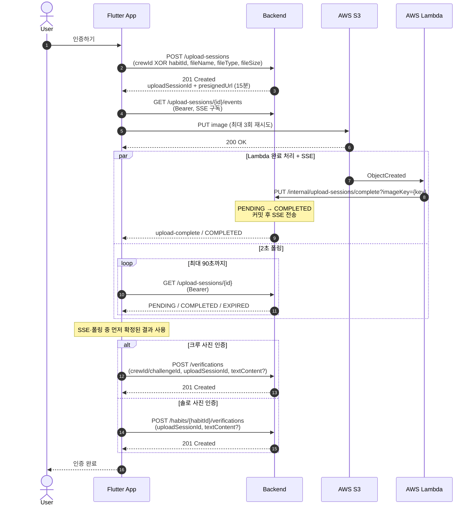

# 사진 인증 업로드 — 사용자 플로우

> 크루 API: [`api-spec/verification.md`](api-spec/verification.md) · 솔로 API: [`api-spec/habit.md`](api-spec/habit.md) · 서버 시퀀스: [`sequence/verification.md`](sequence/verification.md) · Lambda 운영: [`photo-upload-lambda-sse.md`](photo-upload-lambda-sse.md)

이 문서는 Flutter 사용자가 사진 인증을 제출할 때 보이는 흐름만 다룬다. API 필드·에러 계약과 서버 내부 처리의 정본은 위 문서를 따른다.

## 정상 흐름

프론트는 S3 업로드 전에 SSE를 연결한다. S3 업로드 성공 후에는 SSE와 2초 간격 상태 조회를 함께 기다리고, 먼저 `COMPLETED` 또는 `EXPIRED`를 확인한 결과를 사용한다.

## 실패 시 사용자 처리

| 상황 | 처리 |
|------|------|
| S3 업로드 일시 실패 | 같은 Presigned URL로 최대 3회 재시도 |
| Presigned URL 만료 | 새 업로드 세션을 발급받아 다시 업로드 |
| SSE 연결 실패·이벤트 유실 | 병렬 폴링이 상태를 확인 |
| 90초 동안 상태 미확정 | 업로드 확인 실패 안내 |
| 세션 `EXPIRED` (`V006`) | 새 세션 발급 후 재업로드 |
| 세션 `PENDING` 상태로 인증 요청 (`V005`) | 완료 상태를 확인한 뒤 재시도 |
| TEXT 크루에서 세션 생성 (`V017`) | 사진 업로드 없이 텍스트 인증 진행 |
| 인증 마감 초과 (`V002`) | 사진은 서버가 기록한 세션 `requestedAt`을 기준으로 판정 |

## 구현 상태

- SSE 구독·S3 3회 재시도·2초 폴링·90초 제한은 Flutter에 구현되어 있다.
- `GET /upload-sessions/{id}`와 SSE 소유권 검증은 백엔드에 구현되어 있다. 둘 다 인증이 필요하며
  타인 소유·부재 세션은 `404 V004`다.
