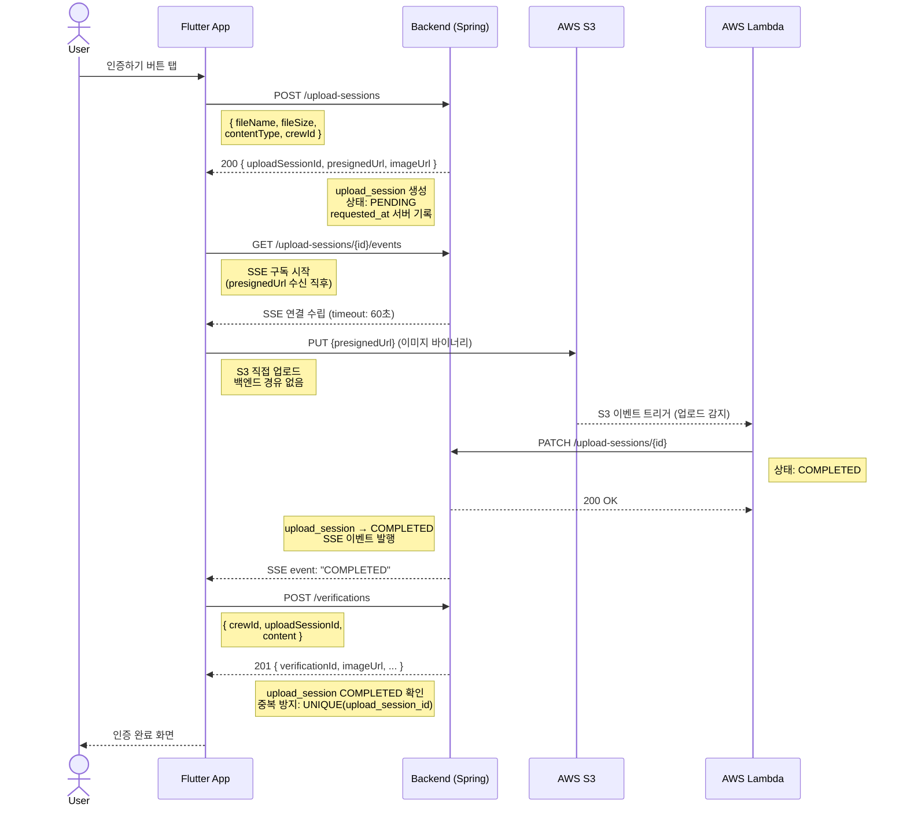
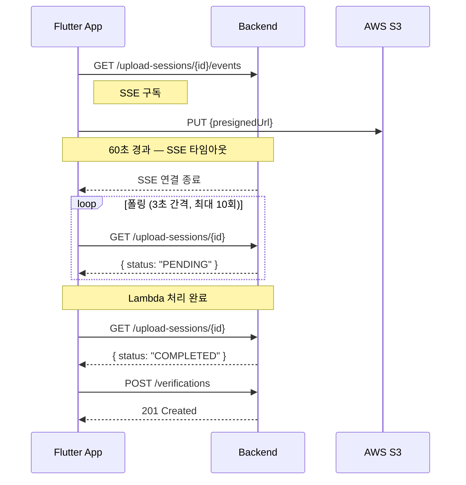
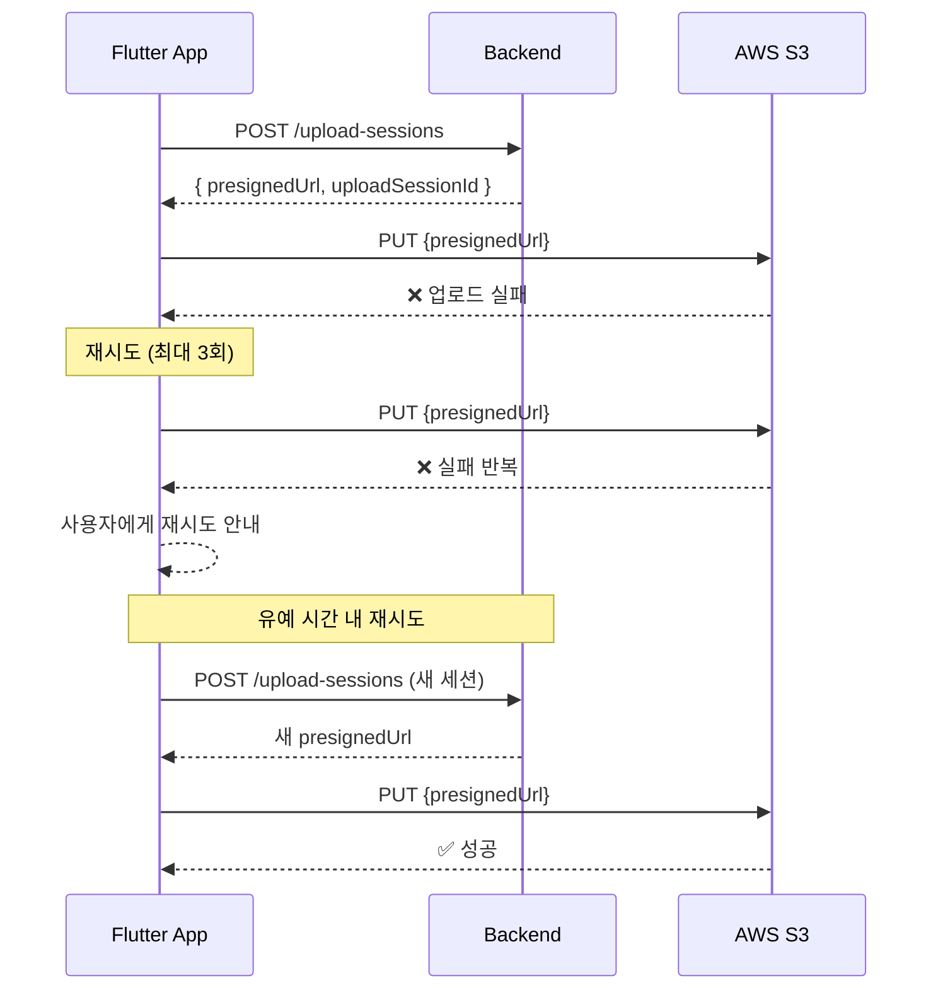

# 사진 인증 업로드 플로우

## 정상 플로우

---

## SSE 타임아웃 → 폴링 fallback

---

## S3 장애 시나리오

---

## 에러 케이스 요약

| 상황 | 에러 코드 | 처리 |
|------|-----------|------|
| upload_session이 COMPLETED 아님 | `UPLOAD_SESSION_NOT_COMPLETED` | S3 업로드 완료 대기 후 재시도 |
| upload_session 만료 | `UPLOAD_SESSION_EXPIRED` | 새 세션 발급 후 재업로드 |
| TEXT 크루에서 upload-session 생성 | `400 Bad Request` | 클라이언트 로직 오류 |
| 마감 시간 초과 | `VERIFICATION_DEADLINE_EXCEEDED` | `requested_at` 기준이므로 업로드 지연은 무관 |

---

## 핵심 설계 결정

- **인증 시간 기준**: `upload_session.requested_at` (서버 기록) — 클라이언트 조작 불가
- **중복 인증 방지**: DB `UNIQUE(upload_session_id)` — 같은 세션으로 두 번 인증 불가
- **S3 직접 업로드**: presigned URL로 클라이언트 → S3 직접 전송, 백엔드 트래픽 없음
- **SSE vs 폴링**: SSE 우선, 타임아웃(60초) 시 폴링 fallback
