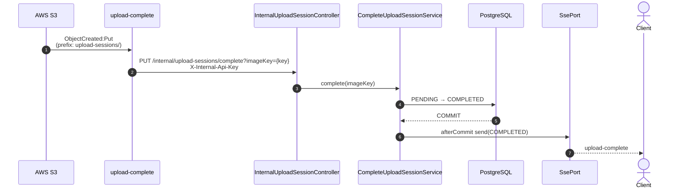

# 사진 업로드 Lambda·S3·SSE 운영

> 사용자 플로우: [`photo-upload-flow.md`](photo-upload-flow.md) · API 계약: [`api-spec/verification.md`](api-spec/verification.md) · 내부 API: [`api-spec/internal.md`](api-spec/internal.md) · 서버 시퀀스: [`sequence/verification.md`](sequence/verification.md)

이 문서는 S3 업로드 완료를 Lambda가 감지해 백엔드 세션을 완료하고 SSE로 알리는 인프라·운영 경계를 다룬다. `/verifications`의 검증·중복 방지 규칙은 정본 문서로 위임한다.

## 1. 운영 흐름

- Lambda는 S3 이벤트의 `imageKey`를 URL 인코딩하여 내부 API에 전달한다.
- 이미 COMPLETED인 세션의 재호출은 성공한다. EXPIRED 세션은 COMPLETED로 되돌리지 않는다.
- SSE는 DB 커밋 후 전송하므로 롤백된 상태를 완료로 알리지 않는다.

## 2. 저장소에서 확인되는 AWS 구성

| 항목 | 저장소 기준 |
|------|-------------|
| Handler | `lambda/upload-complete/handler.py`의 `handler` |
| Runtime | Python 3.12 |
| Timeout / Memory | 15초 / 128MB |
| 대상 Key prefix | `upload-sessions/` |
| 기본 버킷 | `triagain-verifications` (배포 인자로 변경 가능) |
| 환경 변수 | `BACKEND_URL`, `INTERNAL_API_KEY` |
| 배포 | `lambda/deploy-lambda.sh`에서 SAM 배포 후 S3 Notification 설정 |
| S3 이벤트 | `s3:ObjectCreated:Put` |

Presigned URL은 백엔드가 15분으로 발급하고, S3 PUT 요청에 `Content-Type`과 `Content-Length`를 지정한다. 이미지 Key는 `upload-sessions/{userId}/{uuid}.{ext}` 형식이다.

## 3. 내부 API 보안

`/internal/**`은 사용자 API가 아니라 Lambda와 백엔드 사이의 머신 간 API다.

### 운영 (`prod`)

- Spring Security의 `permitAll()`은 사용자 JWT 검사를 요구하지 않기 위한 설정이다.
- `InternalApiKeyFilter`가 모든 `/internal/` 요청의 `X-Internal-Api-Key`를 검사한다.
- Key가 없거나 일치하지 않으면 Controller 전에 `403 Forbidden`을 반환한다.
- API Key는 HTTPS 연결을 전제로 Lambda 환경 변수와 백엔드 설정에 같은 값으로 배포한다.

### 개발·테스트 (`!prod`)

- 로컬·통합 테스트 편의를 위해 `/internal/**`를 허용하며 `InternalApiKeyFilter`를 등록하지 않는다.
- 이 차이는 운영 프로필에 적용되지 않는다.

Phase 1에서는 공유 API Key를 사용한다. HMAC 요청 서명·재전송 방지·IP 제한은 실제 위협이나 운영 요구가 생길 때 검토한다.

## 4. SSE와 폴링

- SSE 서버 타임아웃은 60초다.
- **SSE 구독은 S3 업로드(PUT) 전에 시작한다.** 서버는 미구독 세션의 완료 이벤트를 버리므로,
  구독 전에 Lambda 콜백이 도착하면 이벤트가 영구 유실된다.
- **폴링은 S3 업로드 후 시작한다.** 업로드 전에는 완료될 수 없다.
- 전체 확인 제한은 90초이며, 먼저 `COMPLETED` 또는 `EXPIRED`를 확인한 결과를 사용한다.
- SSE와 상태 조회는 **로그인한 세션 소유자 전용**이다 (§6 참조). 둘 다 인증이 필요하고,
  타인 소유이거나 없는 세션은 `404 V004`로 응답한다.

## 5. 실패 처리와 운영 확인

| 상황 | 저장소에서 확인되는 처리 |
|------|--------------------------|
| Lambda → 백엔드 HTTP 오류 | 예외를 다시 던져 Lambda 실행을 실패 처리 |
| SSE 전송 실패·이벤트 유실 | 상태 조회 폴링으로 보완 |
| 완료 콜백이 끝내 성공하지 않음 | PENDING 세션을 서버가 15분 후 EXPIRED 처리 (5분 주기) |

현재 SAM 템플릿과 배포 스크립트에는 다음 설정이 없다.

- Lambda 비동기 재시도 횟수 재정의
- DLQ (`DeadLetterQueue`)
- 실패 목적지 (`DestinationConfig` / `EventInvokeConfig`)

따라서 “2회 재시도 후 DLQ 전달”을 저장소 기준으로 보장할 수 없다. 실제 운영값은 AWS 계정에서 별도로 확인해야 하며, 보장을 요구한다면 콘솔 수동 설정이 아니라 SAM 템플릿에 선언한다.

배포 후에는 다음을 확인한다.

- Lambda 환경 변수와 백엔드 `internal.api-key` 일치
- S3 Notification의 함수 ARN·이벤트·prefix
- Lambda가 운영 백엔드 URL에 접근 가능한지
- 실패 재시도·DLQ·실패 목적지의 실제 AWS 설정
- CloudWatch에서 Lambda 오류와 내부 API 4xx/5xx

## 6. 인증과 소유권 검증

- `GET /upload-sessions/{id}` 상태 조회와 SSE 구독은 둘 다 인증이 필요하다.
- 소유권 검증은 응용 계층 `UploadSessionQueryUseCase.getOwnedOrThrow(id, userId)` 한 곳에서 이뤄지며,
  폴링·SSE 양쪽이 같은 관문을 통과한다. 실패는 `403`이 아니라 `404 V004`다 — 세션 id 존재 여부를 흘리지 않는다.
- SSE는 **소유권 검증을 emitter 등록보다 먼저** 수행한다. 무단 사용자는 emitter 자체를 만들지 못한다.
- Flutter는 이미 Bearer 토큰으로 SSE를 요청하므로 SSE 인증 적용에 별도 요청 형식 변경은 필요 없다.
