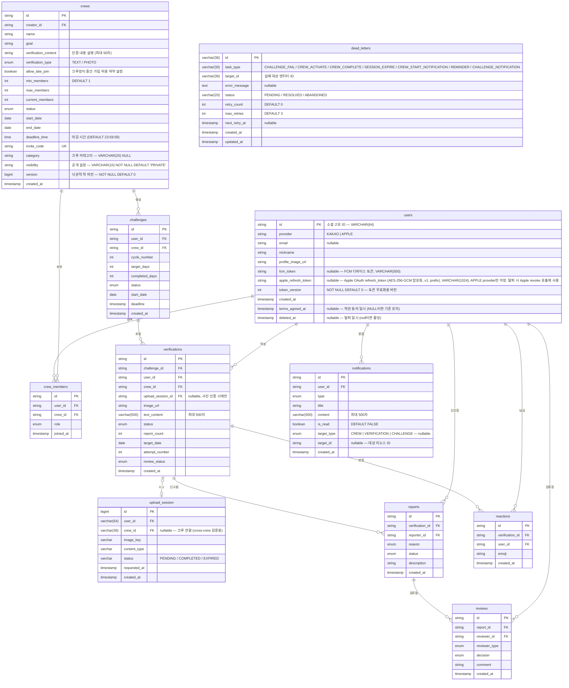

# Schema - ERD 및 데이터 설계

## 1. ERD (Entity Relationship Diagram)



## 2. 주요 관계 설명

| 관계 | 설명 |
|------|------|
| users ↔ crew_members | 유저가 여러 크루에 참여 가능 |
| crews ↔ crew_members | 크루가 여러 멤버 보유 |
| crews ↔ challenges | 크루 내 여러 챌린지 사이클 |
| challenges ↔ verifications | 챌린지당 여러 인증 기록 |
| verifications ↔ upload_session | 사진 인증 시에만 0..1 관계 (nullable FK) |
| verifications ↔ reports | 인증에 대한 신고 |
| reports ↔ reviews | 신고에 대한 검토 |

## 3. 상태(Enum) 정의

### crews.status
| 값 | 의미 |
|----|------|
| RECRUITING | 모집 중 |
| ACTIVE | 진행 중 |
| COMPLETED | 완료 |

### crews.category
| 값 | 의미 |
|----|------|
| EXERCISE | 운동 |
| STUDY | 공부 |
| LIFESTYLE | 생활습관 |
| SELF_DEV | 자기개발 |
| ETC | 기타 |

### crews.visibility
| 값 | 의미 |
|----|------|
| PUBLIC | 공개 (검색 노출) |
| PRIVATE | 비공개 (초대코드만) |

### crews.verification_type
| 값 | 의미 |
|----|------|
| TEXT | 텍스트 인증 (텍스트 필수) |
| PHOTO | 사진 인증 (사진 필수 + 텍스트 선택) |

### crew_members 제약
| 제약 | 컬럼 | 설명 |
|------|------|------|
| UNIQUE | (crew_id, user_id) | 동일 유저가 같은 크루에 2번 이상 가입 불가 — V22(uq_crew_members_crew_id_user_id), 전략 C 동시성 안전망 |

### crew_members.role
| 값 | 의미 |
|----|------|
| LEADER | 크루장 |
| MEMBER | 일반 멤버 |

### challenges.status
| 값 | 의미 |
|----|------|
| IN_PROGRESS | 진행 중 |
| SUCCESS | 3일 연속 성공 |
| FAILED | 실패 (재시작 가능) |
| ENDED | 크루 기간 종료로 인한 챌린지 종료 |

### verifications.status
| 값 | 의미 |
|----|------|
| APPROVED | 정상 인증 (기본값) |
| REPORTED | 신고 접수됨 (3건 이상) |
| HIDDEN | 검토 중 숨김 처리 |
| REJECTED | 검토 후 반려됨 |

### verifications.review_status
| 값 | 의미 |
|----|------|
| NOT_REQUIRED | 검토 불필요 (신고 없음) |
| PENDING | 검토 대기 (신고 3건) |
| IN_REVIEW | 검토 중 |
| COMPLETED | 검토 완료 |

### upload_session.status
| 값 | 의미 |
|----|------|
| PENDING | presignedUrl 발급, S3 업로드 대기 |
| COMPLETED | S3 업로드 완료 (verification 생성 가능) |
| EXPIRED | 시간 초과 / 만료 |

### reports.reason
| 값 | 의미 |
|----|------|
| SPAM | 스팸/도배 |
| INAPPROPRIATE | 부적절한 내용 |
| FAKE | 거짓 인증 |
| COPYRIGHT | 저작권 침해 |
| OTHER | 기타 |

### reports.status
| 값 | 의미 |
|----|------|
| PENDING | 검토 대기 |
| APPROVED | 승인 (조치 완료) |
| REJECTED | 기각 |
| EXPIRED | 7일 미검토 자동 승인 |

### reviews.reviewer_type
| 값 | 의미 |
|----|------|
| AUTO | 자동 (신고 3건) |
| CREW_LEADER | 크루장 |
| AI | AI 검토 (Phase 2+) |
| ADMIN | 관리자 (Phase 3+) |

### reviews.decision
| 값 | 의미 |
|----|------|
| APPROVE | 승인 (문제 없음) |
| REJECT | 반려 (부적절) |
| PENDING | 보류 (추가 검토 필요) |

### dead_letters.status
| 값 | 의미 |
|----|------|
| PENDING | 재시도 대기 |
| RESOLVED | 수동 해결 완료 |
| ABANDONED | 재시도 포기 (max_retries 초과) |

### dead_letters.task_type
| 값 | 의미 |
|----|------|
| CHALLENGE_FAIL | 챌린지 실패 처리 |
| CREW_ACTIVATE | 크루 활성화 (RECRUITING → ACTIVE) |
| CREW_COMPLETE | 크루 종료 (ACTIVE → COMPLETED) |
| SESSION_EXPIRE | 업로드 세션 만료 (PENDING → EXPIRED) |
| CREW_START_NOTIFICATION | 크루 시작 알림 |
| REMINDER | 미인증 리마인더 알림 |
| CHALLENGE_NOTIFICATION | 챌린지 성공/실패 알림 |

### notifications.type
| 값 | 의미 |
|----|------|
| VERIFICATION_APPROVED | 인증 승인 |
| VERIFICATION_REJECTED | 인증 반려 |
| CHALLENGE_SUCCESS | 챌린지 성공 |
| CHALLENGE_FAILED | 챌린지 실패 |
| CREW_INVITE | 크루 초대 |
| REPORT_RECEIVED | 신고 접수 |
| REVIEW_COMPLETED | 검토 완료 |
| UPLOAD_COMPLETED | 이미지 업로드 완료 |
| REMINDER | 인증 리마인더 (스케줄러) |
| CREW_STARTED | 크루 시작 알림 |
| CREW_FIRST_VERIFICATION | 크루 첫 인증 알림 |

### notifications.target_type
| 값 | 의미 |
|----|------|
| CREW | 크루 대상 알림 |
| VERIFICATION | 인증 대상 알림 |
| CHALLENGE | 챌린지 대상 알림 |

## 4. 인덱스 설계

### 핵심 인덱스

```sql
-- 크루 피드 조회 (인증 목록)
CREATE INDEX idx_verification_crew_verified 
ON verification(crew_id, created_at DESC);

-- 중복 인증 방지
CREATE UNIQUE INDEX idx_verification_unique
ON verification(user_id, crew_id, target_date);

-- 동시 챌린지 생성 방지 (유저·크루당 IN_PROGRESS 1개만 허용)
-- Flyway V6에서 추가
CREATE UNIQUE INDEX uk_challenges_user_crew_in_progress
ON challenges(user_id, crew_id)
WHERE status = 'IN_PROGRESS';

-- 신고 중복 방지
CREATE UNIQUE INDEX idx_report_unique
ON report(verification_id, reporter_id);

-- 크루 중복 가입 방지 (유저·크루당 멤버십 1개만 허용)
-- Flyway V22에서 추가 (전략 C 조건부 UPDATE의 동시성 안전망)
CREATE UNIQUE INDEX uq_crew_members_crew_id_user_id
ON crew_members(crew_id, user_id);
```

### 크루 검색 인덱스

```sql
-- 크루 검색 (공개 + 모집중/중간가입 가능)
CREATE INDEX idx_crew_search
ON crews(visibility, status, created_at DESC)
WHERE visibility = 'PUBLIC';
```

### Moderation 관련 인덱스

```sql
-- 신고 횟수 조회 (3건 → REPORTED)
CREATE INDEX idx_verification_report_count
ON verification(report_count) 
WHERE report_count >= 3;

-- 검토 대기 목록 조회
CREATE INDEX idx_verification_review_status
ON verification(review_status, created_at DESC)
WHERE review_status = 'PENDING';

-- 검토자별 검토 이력
CREATE INDEX idx_review_reviewer
ON review(reviewer_id, created_at DESC);

-- 신고 상태별 조회
CREATE INDEX idx_report_status
ON report(status, created_at DESC)
WHERE status = 'PENDING';

-- Lambda의 imageKey 기반 업로드 세션 조회 (Flyway V7)
CREATE INDEX idx_upload_session_image_key
ON upload_session (image_key);
```

### 알림 관련 인덱스

```sql
-- 사용자별 알림 최신순 조회 (Flyway V11)
CREATE INDEX idx_notification_user_created
ON notifications (user_id, created_at DESC);

-- 알림 생성일 기준 조회/정리 (Flyway V11)
CREATE INDEX idx_notification_created
ON notifications (created_at);
```

### Dead Letter 관련 인덱스

```sql
-- 재시도 대상 조회 (상태 + 다음 재시도 시각 기준, Flyway V14)
CREATE INDEX idx_dead_letters_status_retry
ON dead_letters (status, next_retry_at);

-- 작업 유형별 조회 (Flyway V14)
CREATE INDEX idx_dead_letters_task_type
ON dead_letters (task_type);
```

## 5. 설계 트레이드오프: Verification의 3-way FK

Verification이 User, Crew, Challenge를 직접 참조하는 구조를 선택했다.

### 선택 이유

**유연성 관점:**
- 낮은 결합도 (조회 경로 분산)
- 독립적인 도메인 유지
- 변경 영향도 최소화

**성능 관점:**
- 단일 테이블 조회 가능
- JOIN 최소화
- 인덱스 최적화 용이

### 대안 (Crew → Challenge → Verification 계층 구조)
- 인증이 챌린지에 종속
- JOIN 필수 (복잡도 증가)
- 조회 경로 제한

### 결론
3-way FK 구조를 유지하되, Moderation 추가에 따른 인덱스 보강으로 성능을 보완한다.
