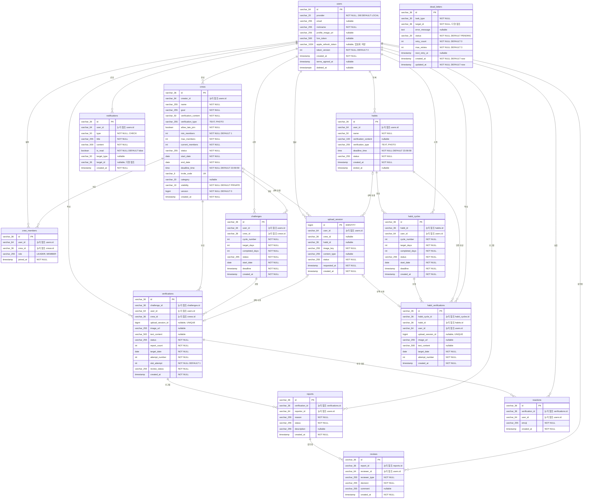

# Schema — 현행 데이터 모델

> 운영 물리 스키마의 정본은 `src/main/resources/db/migration/V*.sql`이다. 이 문서는 모든 Flyway
> 마이그레이션이 적용된 결과를 요약한다. JPA 매핑은 런타임 모델이며 운영 DDL의 정본이 아니다.

---

## 1. 스키마 원칙

- PostgreSQL 운영 스키마에는 **물리 FK 제약이 없다**. 아래 ERD의 관계선과 `*_id`는 논리 참조다.
- 삭제·정합성은 애플리케이션 서비스와 명시적 삭제 쿼리가 책임진다.
- 대부분의 Enum은 `VARCHAR`에 문자열로 저장하며 DB CHECK로 제한하지 않는다.
- 예외적으로 `notifications.type`만 `notifications_type_check`가 허용값을 제한한다.
- 운영은 Flyway를 사용한다. `ddl-auto=create-drop`, Flyway off인 일부 테스트는 JPA 어노테이션으로
  별도 스키마를 생성하므로 양쪽 제약이 갈라질 수 있다.

---

## 2. 논리 ERD

`upload_session.crew_id`와 `habit_id`의 XOR은 DB CHECK가 아니다. 세션 생성 서비스가 요청에서
둘 중 정확히 하나만 선택하도록 검증한다.

---

## 3. Enum 저장값

| 컬럼 | 허용하는 애플리케이션 값 |
|---|---|
| `users.provider` | `KAKAO`, `APPLE` |
| `crews.status` | `RECRUITING`, `ACTIVE`, `COMPLETED` |
| `crews.category` | `EXERCISE`, `STUDY`, `LIFESTYLE`, `SELF_DEV`, `ETC` |
| `crews.visibility` | `PUBLIC`, `PRIVATE` |
| `crews.verification_type` | `TEXT`, `PHOTO` |
| `crew_members.role` | `LEADER`, `MEMBER` |
| `challenges.status` | `IN_PROGRESS`, `SUCCESS`, `FAILED`, `ENDED` |
| `verifications.status` | `APPROVED`, `REPORTED`, `HIDDEN`, `REJECTED`, `CANCELLED` |
| `verifications.review_status` | `NOT_REQUIRED`, `PENDING`, `IN_REVIEW`, `COMPLETED` |
| `upload_session.status` | `PENDING`, `COMPLETED`, `EXPIRED` |
| `reports.reason` | `SPAM`, `INAPPROPRIATE`, `FAKE`, `COPYRIGHT`, `OTHER` |
| `reports.status` | `PENDING`, `APPROVED`, `REJECTED`, `EXPIRED` |
| `reviews.reviewer_type` | `AUTO`, `CREW_LEADER`, `AI`, `ADMIN` |
| `reviews.decision` | `APPROVE`, `REJECT`, `PENDING` |
| `notifications.type` | `VERIFICATION_APPROVED`, `VERIFICATION_REJECTED`, `CHALLENGE_SUCCESS`, `CHALLENGE_FAILED`, `CREW_INVITE`, `REPORT_RECEIVED`, `REVIEW_COMPLETED`, `UPLOAD_COMPLETED`, `REMINDER`, `CREW_STARTED`, `CREW_FIRST_VERIFICATION` |
| `notifications.target_type` | `CREW`, `VERIFICATION`, `CHALLENGE` |
| `reactions.emoji` | Enum: `LIKE`, `FIRE`, `CLAP`, `HEART`, `LAUGH`; v1 요청 허용값: `LIKE` |
| `dead_letters.status` | `PENDING`, `RESOLVED`, `ABANDONED` |
| `dead_letters.task_type` | `CHALLENGE_FAIL`, `CREW_ACTIVATE`, `CREW_COMPLETE`, `SESSION_EXPIRE`, `CREW_START_NOTIFICATION`, `REMINDER`, `CHALLENGE_NOTIFICATION`, `HABIT_CYCLE_FAIL` |
| `habits.status` | `ACTIVE`, `PAUSED`, `ENDED` |
| `habits.verification_type` | `TEXT`, `PHOTO` |
| `habit_cycles.status` | `IN_PROGRESS`, `SUCCESS`, `FAILED` |

`users.provider`의 애플리케이션 값은 KAKAO/APPLE이지만 물리 컬럼의 기본값은 과거 데이터 이관을
위해 `LOCAL`로 남아 있다. DB CHECK는 없으므로 물리적으로는 다른 문자열도 저장할 수 있다.

---

## 4. 유니크·CHECK 제약

| 이름 | 대상 | 역할 |
|---|---|---|
| `uk_crews_invite_code` | `crews(invite_code)` | 초대 코드 중복 방지 |
| `uq_crew_members_crew_id_user_id` | `crew_members(crew_id, user_id)` | 같은 크루 중복 가입 방지 |
| `uk_challenges_user_crew_in_progress` | `challenges(user_id, crew_id) WHERE status='IN_PROGRESS'` | 사용자·크루별 진행 중 챌린지 1개 |
| `uk_verifications_upload_session` | `verifications(upload_session_id)` | 업로드 세션 1회 사용, null 중복 허용 |
| `uk_verifications_user_crew_date_active` | `verifications(user_id, crew_id, target_date) WHERE status<>'CANCELLED'` | 취소되지 않은 일일 인증 1개 |
| `uk_reports_verification_reporter` | `reports(verification_id, reporter_id)` | 동일 인증 중복 신고 방지 |
| `uk_reactions_verification_user` | `reactions(verification_id, user_id)` | 사용자별 인증 반응 1개, upsert 충돌 대상 |
| `notifications_type_check` | `notifications.type` | 현재 NotificationType 값만 허용 |
| `uk_habit_cycles_in_progress` | `habit_cycles(habit_id) WHERE status='IN_PROGRESS'` | 습관별 진행 중 사이클 1개 |
| `uk_habit_verifications_habit_date` | `habit_verifications(habit_id, target_date)` | 습관별 일일 인증 1개 |
| `uk_habit_verifications_upload_session` | `habit_verifications(upload_session_id)` | 솔로 업로드 세션 1회 사용, null 중복 허용 |

부분 유니크 인덱스는 JPA `@UniqueConstraint`로 표현할 수 없으므로 Flyway 적용 여부가 중요하다.
`uk_reactions_verification_user`는 네이티브 `ON CONFLICT`의 충돌 대상이므로 운영 Flyway와
테스트용 `ReactionJpaEntity` 양쪽에 같은 제약이 필요하다.

---

## 5. 조회 인덱스

| 이름 | 대상·조건 | 사용 목적 |
|---|---|---|
| `idx_verifications_crew_created` | `verifications(crew_id, created_at DESC)` | 크루 피드 |
| `idx_verifications_report_count` | `verifications(report_count) WHERE report_count>=3` | 신고 임계치 조회 |
| `idx_verifications_review_status` | `verifications(review_status, created_at DESC) WHERE review_status='PENDING'` | 검토 대기 목록 |
| `idx_reviews_reviewer` | `reviews(reviewer_id, created_at DESC)` | 검토자 이력 |
| `idx_reports_status` | `reports(status, created_at DESC) WHERE status='PENDING'` | 신고 대기 목록 |
| `idx_upload_session_image_key` | `upload_session(image_key)` | Lambda 완료 세션 조회 |
| `idx_crew_search` | `crews(visibility, status, created_at DESC) WHERE visibility='PUBLIC'` | 공개 크루 검색 |
| `idx_notification_user_created` | `notifications(user_id, created_at DESC)` | 사용자별 최신 알림 |
| `idx_notification_created` | `notifications(created_at)` | 생성일 기준 조회·정리 |
| `idx_notification_user_is_read` | `notifications(user_id, is_read)` | 읽음 필터·전체 읽음 |
| `idx_dead_letters_status_retry` | `dead_letters(status, next_retry_at)` | 재시도 대상 조회 |
| `idx_dead_letters_task_type` | `dead_letters(task_type)` | 작업 유형별 조회 |
| `idx_habits_user` | `habits(user_id) WHERE status<>'ENDED'` | 활성·중지 습관 홈 목록 |

유니크 인덱스는 4절에만 기재한다.

---

## 6. 삭제와 정합성

- FK cascade가 없으므로 하드 삭제 경로는 연관 테이블을 명시적으로 정리해야 한다.
- 회원탈퇴는 `users`를 삭제하지 않고 익명화·soft delete하므로 기존 인증·반응 이력은 남는다.
- 크루 하드 삭제는 멤버십, 챌린지, 인증, 신고·검토·반응 등 연관 데이터를 서비스에서 정리한다.
- `notifications.target_id`와 `dead_letters.target_id`는 다형 참조이며 DB 무결성 검증이 없다.
- `verifications`는 조회 편의를 위해 user, crew, challenge ID를 함께 저장한다. DB FK가 없으므로
  생성 서비스가 세 값의 일치와 소유 관계를 검증해야 한다.

---

## 7. 확인된 스키마 경계

- 운영 스키마에는 `uk_habit_verifications_upload_session`이 있지만
  `HabitVerificationJpaEntity`에는 같은 유니크 선언이 없다. Flyway off + create-drop 테스트 스키마는
  운영과 다르게 중복 upload_session_id를 허용한다.
- `users.deleted_at`은 Flyway에서 `TIMESTAMPTZ`, JPA에서는 `LocalDateTime`으로 매핑한다.
  운영 DB 세션 시간대에 따른 변환 여부를 별도로 검증해야 한다.
- `users.id`는 카카오 ID와 Apple `sub`가 공유하는 단일 PK다. provider별 별도 ID 공간이나
  `(provider, provider_id)` 복합 유니크 구조는 현재 없다.
