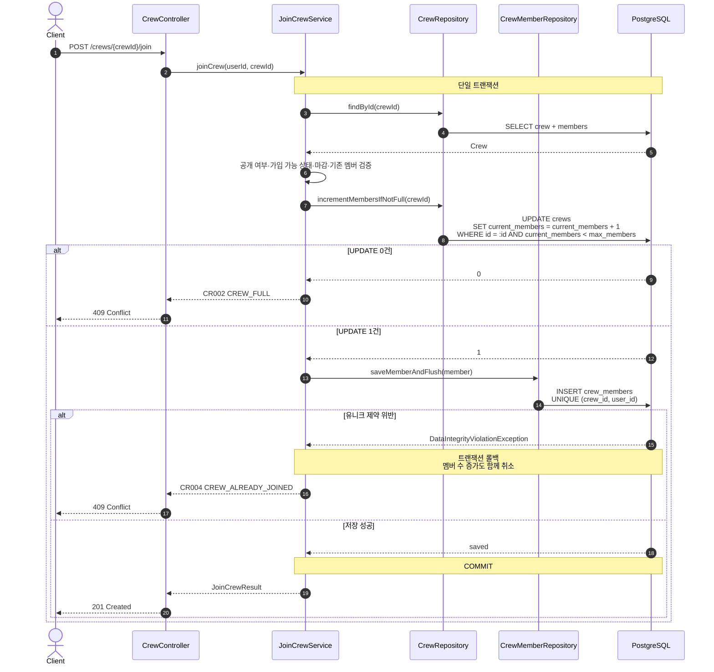

# 시퀀스 다이어그램 - 크루 가입

> 정본 규칙: [`../biz-logic.md`](../biz-logic.md) · API 계약: [`../api-spec/crew.md`](../api-spec/crew.md)

## 1. 적용 범위

- 공개 크루 직접 가입: `POST /crews/{crewId}/join`
- 초대코드 가입: `POST /crews/join`
- 기본 동시성 전략: `triagain.crew.lock-strategy=CONDITIONAL`
- 두 API 모두 `201 Created`를 반환한다
- `Idempotency-Key`, Redis 분산 락, 응답 캐시는 사용하지 않는다

공개 크루 직접 가입은 `visibility=PUBLIC`을 검증한다. 초대코드 가입은 유효한 초대코드 자체를 접근 권한으로 사용하므로 비공개 크루도 가입할 수 있다. 이후 상태·참여 마감·정원·중복 검증은 동일하다.

## 2. 기본 흐름 (`CONDITIONAL`)

초대코드 가입은 첫 조회가 `findByInviteCode(inviteCode)`이고 공개 여부 검증을 생략한다. 나머지 조건부 UPDATE와 멤버 INSERT 흐름은 같다.

## 3. 동시성 보장

| 대상 | 최종 방어 | 결과 |
|------|-----------|------|
| 정원 초과 | `current_members < max_members` 조건부 원자적 UPDATE | 성공한 요청만 멤버 수를 1 증가시킴 |
| 동일 유저 중복 가입 | `uq_crew_members_crew_id_user_id` 유니크 인덱스 | 동시 INSERT 중 하나만 성공 |

PostgreSQL은 경합한 UPDATE의 조건을 다시 평가하므로 `current_members`가 `max_members`를 넘지 않는다. 멤버 INSERT가 실패하면 같은 트랜잭션의 멤버 수 증가도 롤백된다.

이 API는 Idempotency-Key 기반 멱등 API가 아니다. 첫 가입 성공 후 같은 요청을 다시 보내면 기존 응답을 재사용하지 않고 `409 CR004`를 반환한다.

## 4. 선택 가능한 대체 전략

운영 기본값은 `CONDITIONAL`이며, 설정 변경으로 다음 전략도 사용할 수 있다.

| 전략 | 처리 방식 | 충돌 처리 |
|------|-----------|-----------|
| `PESSIMISTIC` | 크루를 `SELECT … FOR NO KEY UPDATE`로 잠근 뒤 가입 | DB 행 락으로 직렬화 |
| `OPTIMISTIC` | `version` 조건부 UPDATE | 최대 `triagain.crew.max-retry`회 재시도 후 `409 CR023` |
| `CONDITIONAL` | 정원 조건부 UPDATE + 멤버 유니크 제약 | 재시도 없이 `CR002` 또는 `CR004` |
