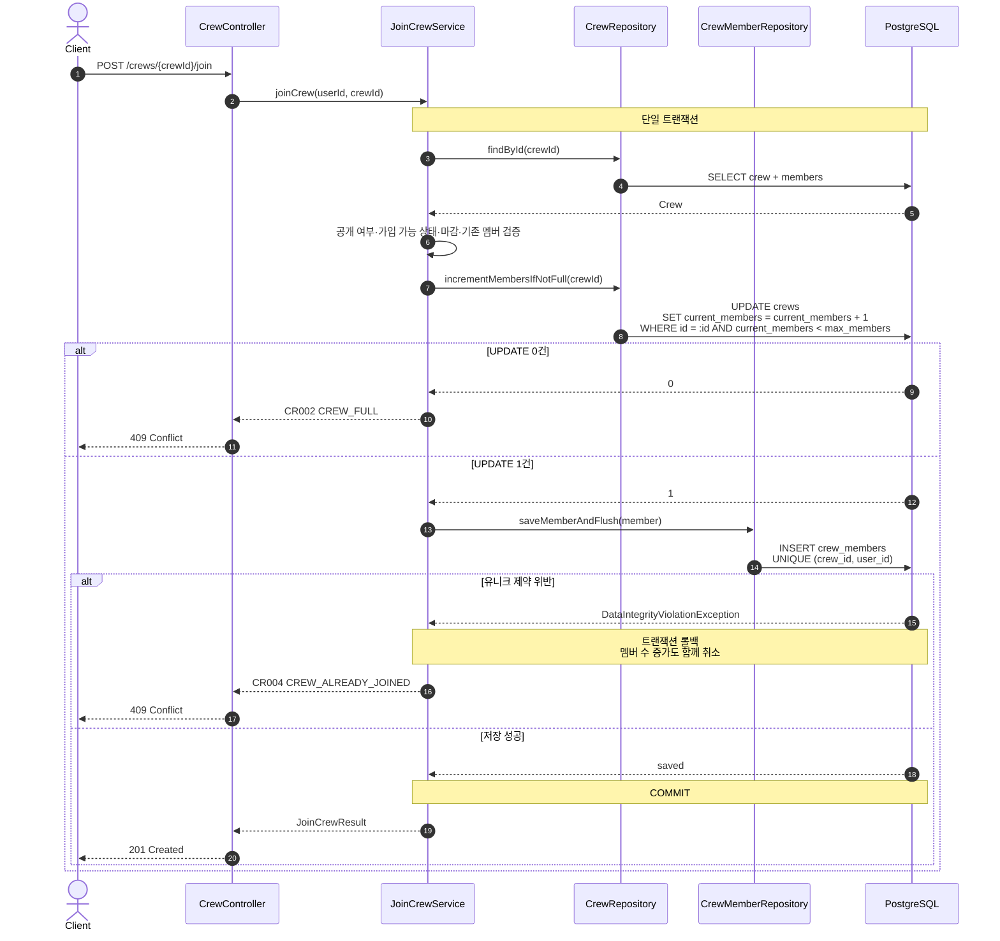
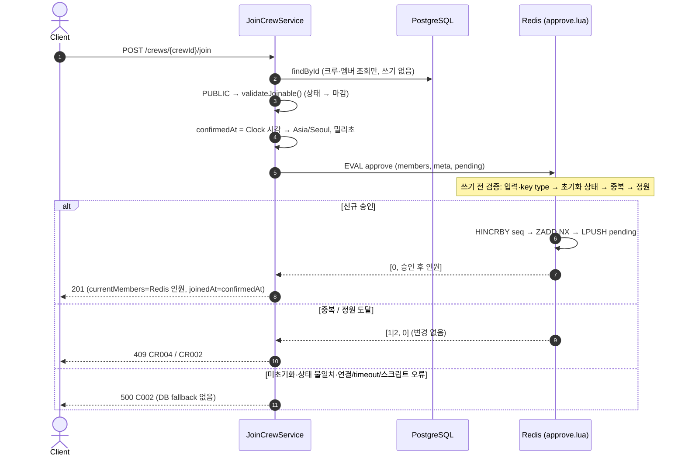
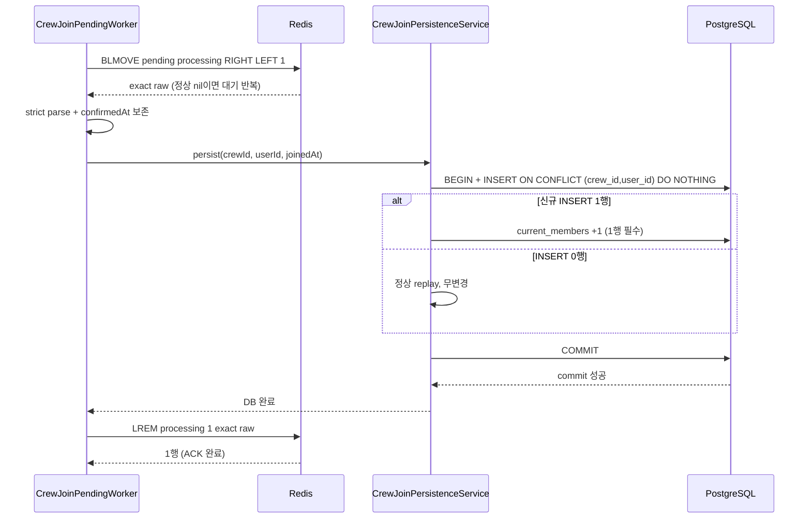
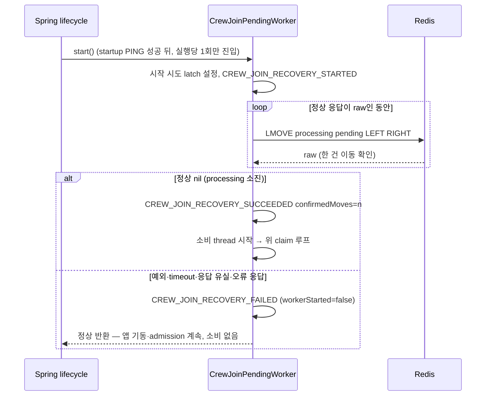

# 시퀀스 다이어그램 - 크루 가입

> 정본 규칙: [`../biz-logic.md`](../biz-logic.md) · API 계약: [`../api-spec/crew.md`](../api-spec/crew.md)

## 1. 적용 범위

- 공개 크루 직접 가입: `POST /crews/{crewId}/join`
- 초대코드 가입: `POST /crews/join`
- 기본 동시성 전략: `triagain.crew.lock-strategy=CONDITIONAL`
- 기존 세 DB 전략에서 두 API 모두 가입 성공 시 `201 Created`를 반환한다
- `Idempotency-Key`, Redis 분산 락, 응답 캐시는 사용하지 않는다 (`REDIS_ASYNC`는 락이 아니라 Lua 원자 승인 — 5절)

공개 크루 직접 가입은 `visibility=PUBLIC`을 검증한다. 초대코드 가입은 유효한 초대코드 자체를 접근 권한으로 사용하므로 비공개 크루도 가입할 수 있다. 이후 상태·참여 마감·정원·중복 검증은 동일하다.

## 2. 기본 흐름 (`CONDITIONAL`)

```mermaid
sequenceDiagram
    autonumber
    actor Client
    participant Controller as CrewController
    participant Service as JoinCrewService
    participant CrewRepo as CrewRepository
    participant MemberRepo as CrewMemberRepository
    participant DB as PostgreSQL

    Client->>Controller: POST /crews/{crewId}/join
    Controller->>Service: joinCrew(userId, crewId)
    Note over Service,DB: 단일 트랜잭션

    Service->>CrewRepo: findById(crewId)
    CrewRepo->>DB: SELECT crew + members
    DB-->>Service: Crew
    Service->>Service: 공개 여부·가입 가능 상태·마감·기존 멤버 검증

    Service->>CrewRepo: incrementMembersIfNotFull(crewId)
    CrewRepo->>DB: UPDATE crews<br/>SET current_members = current_members + 1<br/>WHERE id = :id AND current_members < max_members

    alt UPDATE 0건
        DB-->>Service: 0
        Service-->>Controller: CR002 CREW_FULL
        Controller-->>Client: 409 Conflict
    else UPDATE 1건
        DB-->>Service: 1
        Service->>MemberRepo: saveMemberAndFlush(member)
        MemberRepo->>DB: INSERT crew_members<br/>UNIQUE (crew_id, user_id)

        alt 유니크 제약 위반
            DB-->>Service: DataIntegrityViolationException
            Note over Service,DB: 트랜잭션 롤백<br/>멤버 수 증가도 함께 취소
            Service-->>Controller: CR004 CREW_ALREADY_JOINED
            Controller-->>Client: 409 Conflict
        else 저장 성공
            DB-->>Service: saved
            Note over Service,DB: COMMIT
            Service-->>Controller: JoinCrewResult
            Controller-->>Client: 201 Created
        end
    end
```

초대코드 가입은 첫 조회가 `findByInviteCode(inviteCode)`이고 공개 여부 검증을 생략한다. 나머지 조건부 UPDATE와 멤버 INSERT 흐름은 같다.

## 3. 동시성 보장

| 대상 | 최종 방어 | 결과 |
|------|-----------|------|
| 정원 초과 | `current_members < max_members` 조건부 원자적 UPDATE | 성공한 요청만 멤버 수를 1 증가시킴 |
| 동일 유저 중복 가입 | `uq_crew_members_crew_id_user_id` 유니크 인덱스 | 동시 INSERT 중 하나만 성공 |

PostgreSQL은 경합한 UPDATE의 조건을 다시 평가하므로 `current_members`가 `max_members`를 넘지 않는다. 멤버 INSERT가 실패하면 같은 트랜잭션의 멤버 수 증가도 롤백된다.

이 API는 Idempotency-Key 기반 멱등 API가 아니다. 첫 가입 성공 후 같은 요청을 다시 보내면 기존 응답을 재사용하지 않고 `409 CR004`를 반환한다.

## 4. 선택 가능한 대체 전략

운영 기본값은 `CONDITIONAL`이며, 설정 변경으로 다음 전략도 사용할 수 있다.

| 전략 | 처리 방식 | 충돌 처리 |
|------|-----------|-----------|
| `PESSIMISTIC` | 크루를 `SELECT … FOR NO KEY UPDATE`로 잠근 뒤 가입 | DB 행 락으로 직렬화 |
| `OPTIMISTIC` | `version` 조건부 UPDATE | 최대 `triagain.crew.max-retry`회 재시도 후 `409 CR023` |
| `CONDITIONAL` | 정원 조건부 UPDATE + 멤버 유니크 제약 | 재시도 없이 `CR002` 또는 `CR004` |
| `REDIS_ASYNC` | 공개 가입은 Redis 승인 + pending 등록, worker가 DB 비동기 반영 (5절). 초대 가입은 즉시 거부 | Lua가 `CR004`/`CR002` 판정, 인프라·상태 실패는 500/C002, DB fallback 없음 |

두 가입 Service는 `LockStrategy`의 네 값을 default 없는 switch로 처리한다.
REDIS_ASYNC 초대 가입 거부는 가입 Repository 호출·TransactionTemplate 실행 전에 발생한다.
`Crew.validateJoinable()`은 상태·마감만 검사하며, 기존 addMember 경로의 정원/중복 검사 순서는 유지한다.

## 5. `REDIS_ASYNC` 공개 가입 (로컬 실험 전용)

```mermaid
sequenceDiagram
    autonumber
    actor Client
    participant Service as JoinCrewService
    participant DB as PostgreSQL
    participant Redis as Redis (approve.lua)

    Client->>Service: POST /crews/{crewId}/join
    Service->>DB: findById (크루·멤버 조회만, 쓰기 없음)
    Service->>Service: PUBLIC → validateJoinable() (상태 → 마감)
    Service->>Service: confirmedAt = Clock 시각 → Asia/Seoul, 밀리초
    Service->>Redis: EVAL approve (members, meta, pending)
    Note over Redis: 쓰기 전 검증: 입력·key type → 초기화 상태 → 중복 → 정원
    alt 신규 승인
        Redis->>Redis: HINCRBY seq → ZADD NX → LPUSH pending
        Redis-->>Service: [0, 승인 후 인원]
        Service-->>Client: 201 (currentMembers=Redis 인원, joinedAt=confirmedAt)
    else 중복 / 정원 도달
        Redis-->>Service: [1|2, 0] (변경 없음)
        Service-->>Client: 409 CR004 / CR002
    else 미초기화·상태 불일치·연결/timeout/스크립트 오류
        Service-->>Client: 500 C002 (DB fallback 없음)
    end
```

- 201은 Redis 승인·pending 등록 완료다. worker commit 전에는 DB 기반 조회가 아직 비멤버로 판단할 수 있다.
  commit 뒤 새 조회는 가입을 인식한다. 반영 시간·polling·새 API 보장은 없다.
- 앱 기동: `REDIS_ASYNC`일 때만 웹 서버가 포트를 열기 전 Redis PING을 하고, 실패하면 기동이 중단된다.
  DB 세 전략은 Redis 없이 기동하며 `/actuator/health`에 Redis가 포함되지 않는다.

### 단일 worker의 DB 반영과 ACK

```mermaid
sequenceDiagram
    participant W as CrewJoinPendingWorker
    participant R as Redis
    participant S as CrewJoinPersistenceService
    participant DB as PostgreSQL
    W->>R: BLMOVE pending processing RIGHT LEFT 1
    R-->>W: exact raw (정상 nil이면 대기 반복)
    W->>W: strict parse + confirmedAt 보존
    W->>S: persist(crewId, userId, joinedAt)
    S->>DB: BEGIN + INSERT ON CONFLICT (crew_id,user_id) DO NOTHING
    alt 신규 INSERT 1행
        S->>DB: current_members +1 (1행 필수)
    else INSERT 0행
        S->>S: 정상 replay, 무변경
    end
    S->>DB: COMMIT
    DB-->>S: commit 성공
    S-->>W: DB 완료
    W->>R: LREM processing 1 exact raw
    R-->>W: 1행 (ACK 완료)
```

- parse/DB 실패·commit 결과 불명이면 ACK하지 않고 소비 루프를 중단한다. 증가 0행은 invariant 불일치로 INSERT도 rollback한다.
- claim 예외는 이동 결과 불명, ACK 0행/예외는 DB commit 유지·raw 존재 불명으로 중단한다. 다음 claim·retry는 없다.
  worker 전용 Lettuce 클라이언트도 연결 단절 뒤 claim·ACK를 재전송하지 않는다. producer 설정은 유지한다.
- 정상 종료는 새 claim을 막고 진행 중 작업의 commit→ACK를 기다린다. 10초 join 한도 초과는 미완료 로그를 남긴다.
- 같은 프로세스의 runtime retry/reprocessing은 없다. 다음 앱 기동에서는 아래 startup recovery를 수행한다.
  processing 잔존을 이유로 기동을 거부하지 않는다.

### 재기동 시 Queue 복구 (소비 시작 전)

```mermaid
sequenceDiagram
    participant L as Spring lifecycle
    participant W as CrewJoinPendingWorker
    participant R as Redis
    L->>W: start() (startup PING 성공 뒤, 실행당 1회만 진입)
    W->>W: 시작 시도 latch 설정, CREW_JOIN_RECOVERY_STARTED
    loop 정상 응답이 raw인 동안
        W->>R: LMOVE processing pending LEFT RIGHT
        R-->>W: raw (한 건 이동 확인)
    end
    alt 정상 nil (processing 소진)
        W->>W: CREW_JOIN_RECOVERY_SUCCEEDED confirmedMoves=n
        W->>W: 소비 thread 시작 → 위 claim 루프
    else 예외·timeout·응답 유실·오류 응답
        W->>W: CREW_JOIN_RECOVERY_FAILED (workerStarted=false)
        W-->>L: 정상 반환 — 앱 기동·admission 계속, 소비 없음
    end
```

- 실패 뒤 같은 프로세스에서 recovery·소비를 다시 시도하지 않는다(`context.start()` 재호출 포함). 추가 이동·ACK·보상도 없다.
  다음 앱 재기동이 실제 남은 processing을 같은 방향으로 이어 비운다.
- 복구된 작업은 위 DB 반영 흐름(INSERT 1/0행 → COMMIT → exact raw ACK)으로 replay된다. recovery 성공은 DB 수렴의 증거가 아니다.
- recovery는 `start()` 안에서 동기로 실행된다. 일반 종료 요청이 recovery를 즉시 취소한다고 보장하지 않는다.
