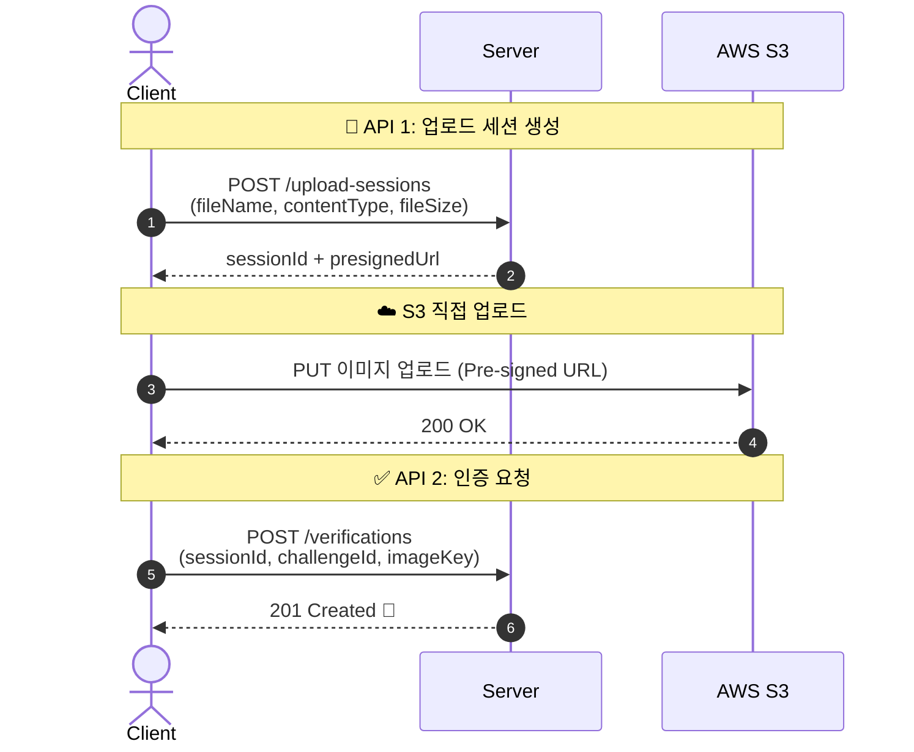
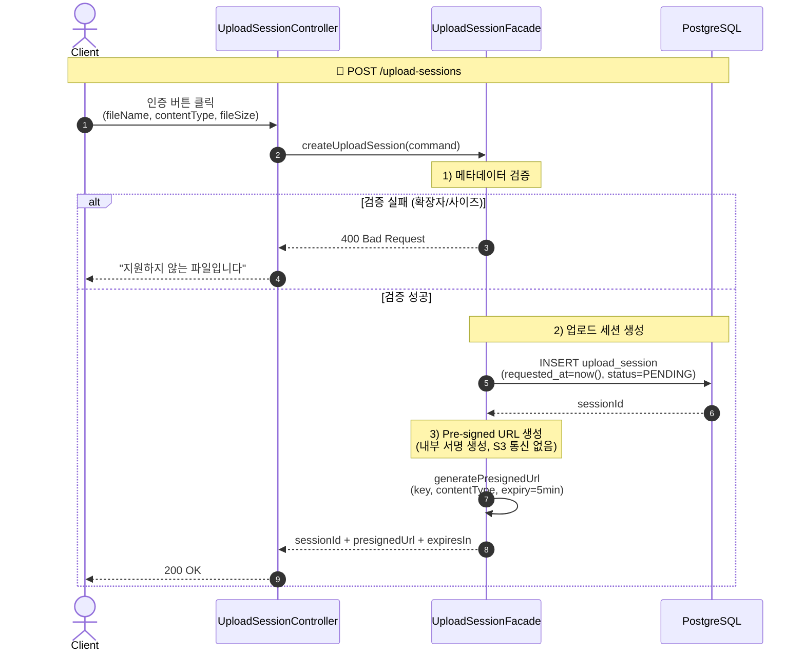
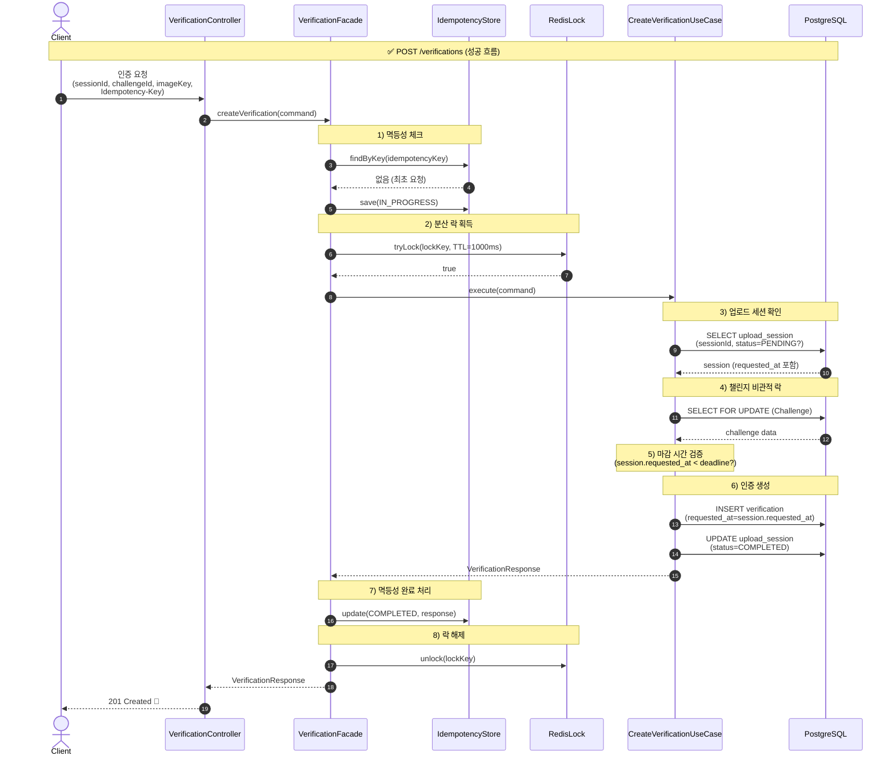
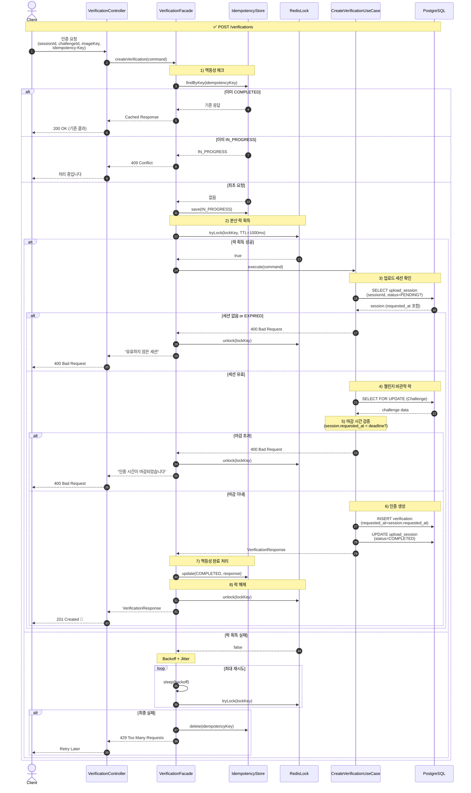

# 시퀀스 다이어그램 - 인증 업로드

## 1. 전체 흐름 (간략)

## 2. POST /upload-sessions 상세

검증 → 세션 생성 → Pre-signed URL 발급

**핵심 포인트:**
- Pre-signed URL 생성은 S3 통신 없음 (내부 서명 생성)
- requested_at은 서버 시간으로 기록 (마감 시간 기준점)
- PENDING 세션은 스케줄러가 30분 후 EXPIRED 처리

## 3. POST /verifications 상세 (성공 흐름)

## 4. POST /verifications 상세 (전체 - 실패 포함)

## 5. 실패 대책 요약

| 실패 상황 | 누가 처리? | 어떻게? |
|-----------|-----------|---------|
| S3 업로드 실패 | 클라이언트 | 재시도 → 실패 시 안내 |
| URL 만료 후 재시도 | 클라이언트 | API 1부터 다시 (새 URL 발급) |
| PENDING 세션 방치 | 서버 스케줄러 | EXPIRED 처리 |

## 6. 트랜잭션 규칙

verification INSERT와 upload_session COMPLETED 전환은 동일 트랜잭션에서 처리한다.

**처리 순서:**
1. upload_session 조회 + 락 (SELECT ... FOR UPDATE)
2. 상태 검증: PENDING 아니면 409
3. verification INSERT (기본 APPROVED, UNIQUE로 중복 방지)
4. upload_session.status = COMPLETED UPDATE
5. COMMIT
