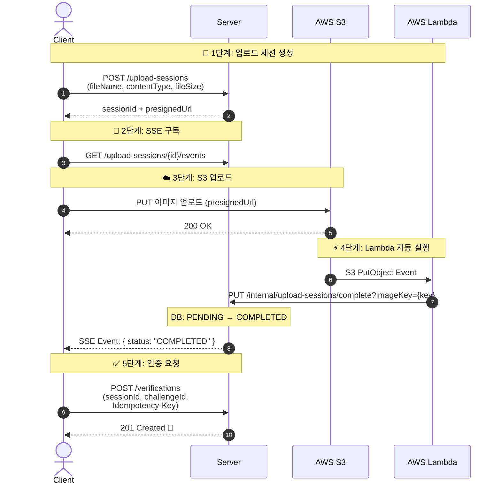
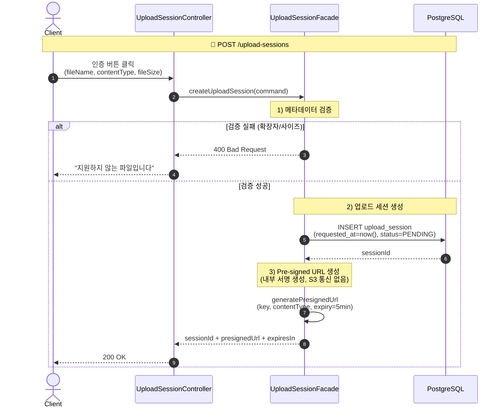
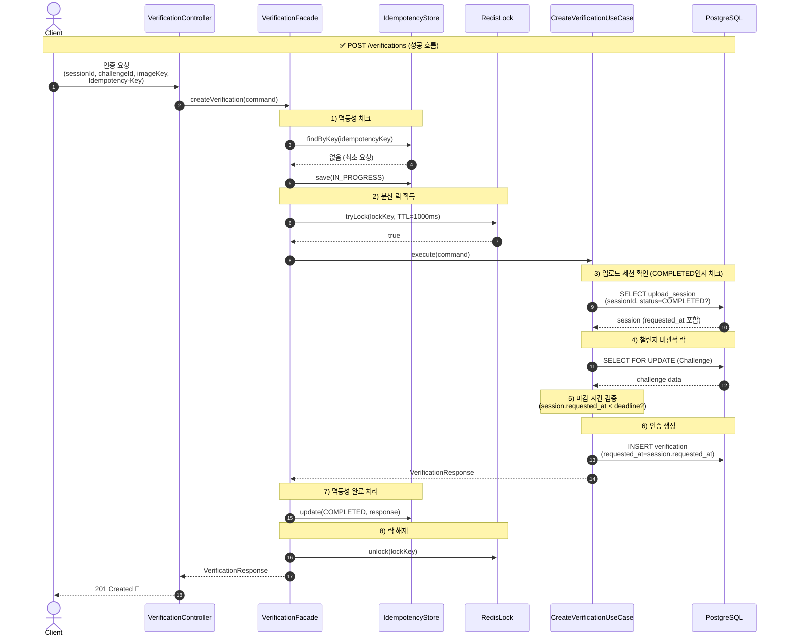
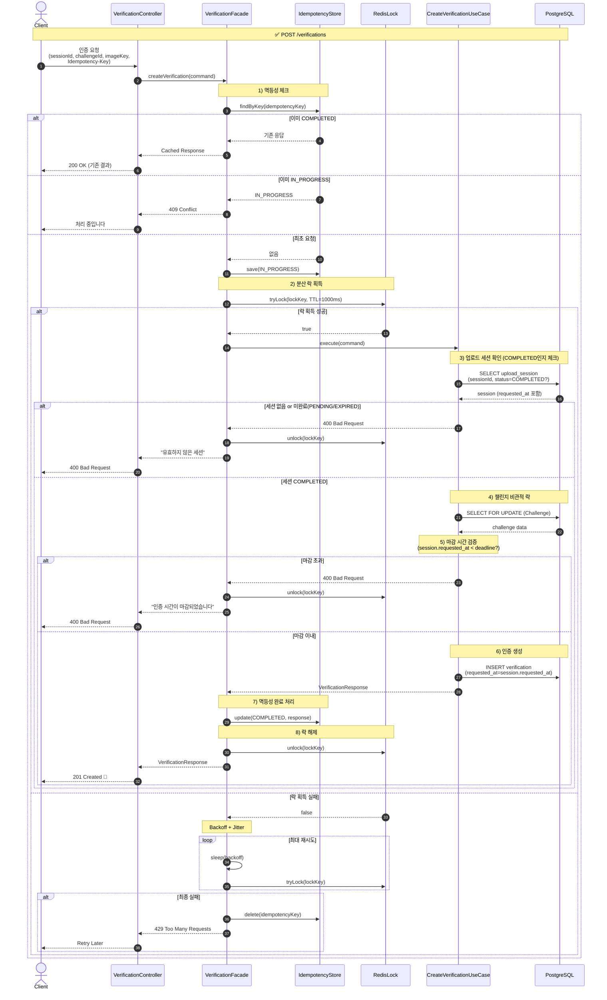

# 시퀀스 다이어그램 - 인증 업로드

## 1. 전체 흐름 (간략)

```mermaid
sequenceDiagram
    autonumber
    actor Client as Client
    participant Server as Server
    participant S3 as AWS S3
    participant Lambda as AWS Lambda

    Note over Client,Lambda: 📸 1단계: 업로드 세션 생성

    Client->>Server: POST /upload-sessions<br/>(fileName, contentType, fileSize)
    Server-->>Client: sessionId + presignedUrl

    Note over Client,Server: 📡 2단계: SSE 구독

    Client->>Server: GET /upload-sessions/{id}/events

    Note over Client,S3: ☁️ 3단계: S3 업로드

    Client->>S3: PUT 이미지 업로드 (presignedUrl)
    S3-->>Client: 200 OK

    Note over S3,Lambda: ⚡ 4단계: Lambda 자동 실행

    S3->>Lambda: S3 PutObject Event
    Lambda->>Server: PUT /internal/upload-sessions/complete?imageKey={key}
    Note over Server: DB: PENDING → COMPLETED
    Server-->>Client: SSE Event: { status: "COMPLETED" }

    Note over Client,Server: ✅ 5단계: 인증 요청

    Client->>Server: POST /verifications<br/>(sessionId, challengeId,<br/>Idempotency-Key)
    Server-->>Client: 201 Created 🎉
```

## 2. POST /upload-sessions 상세

검증 → 세션 생성 → Pre-signed URL 발급

```mermaid
sequenceDiagram
    autonumber
    actor Client as Client
    participant Controller as UploadSessionController
    participant Facade as UploadSessionFacade
    participant DB as PostgreSQL

    Note over Client,DB: 📸 POST /upload-sessions

    Client->>Controller: 인증 버튼 클릭<br/>(fileName, contentType, fileSize)
    Controller->>Facade: createUploadSession(command)

    Note over Facade: 1) 메타데이터 검증

    alt 검증 실패 (확장자/사이즈)
        Facade-->>Controller: 400 Bad Request
        Controller-->>Client: "지원하지 않는 파일입니다"
    else 검증 성공
        Note over Facade,DB: 2) 업로드 세션 생성

        Facade->>DB: INSERT upload_session<br/>(requested_at=now(), status=PENDING)
        DB-->>Facade: sessionId

        Note over Facade: 3) Pre-signed URL 생성<br/>(내부 서명 생성, S3 통신 없음)

        Facade->>Facade: generatePresignedUrl<br/>(key, contentType, expiry=5min)

        Facade-->>Controller: sessionId + presignedUrl + expiresIn
        Controller-->>Client: 200 OK
    end
```

**핵심 포인트:**
- Pre-signed URL 생성은 S3 통신 없음 (내부 서명 생성)
- requested_at은 서버 시간으로 기록 (마감 시간 기준점)
- PENDING 세션은 스케줄러가 30분 후 EXPIRED 처리

## 3. POST /verifications 상세 (성공 흐름)

```mermaid
sequenceDiagram
    autonumber
    actor Client as Client
    participant Controller as VerificationController
    participant Facade as VerificationFacade
    participant IdemStore as IdempotencyStore
    participant Lock as RedisLock
    participant UseCase as CreateVerificationUseCase
    participant DB as PostgreSQL

    Note over Client,DB: ✅ POST /verifications (성공 흐름)

    Client->>Controller: 인증 요청<br/>(sessionId, challengeId, imageKey,<br/>Idempotency-Key)
    Controller->>Facade: createVerification(command)

    Note over Facade,IdemStore: 1) 멱등성 체크
    Facade->>IdemStore: findByKey(idempotencyKey)
    IdemStore-->>Facade: 없음 (최초 요청)
    Facade->>IdemStore: save(IN_PROGRESS)

    Note over Facade,Lock: 2) 분산 락 획득
    Facade->>Lock: tryLock(lockKey, TTL=1000ms)
    Lock-->>Facade: true

    Facade->>UseCase: execute(command)

    Note over UseCase,DB: 3) 업로드 세션 확인 (COMPLETED인지 체크)
    UseCase->>DB: SELECT upload_session<br/>(sessionId, status=COMPLETED?)
    DB-->>UseCase: session (requested_at 포함)

    Note over UseCase,DB: 4) 챌린지 비관적 락
    UseCase->>DB: SELECT FOR UPDATE (Challenge)
    DB-->>UseCase: challenge data

    Note over UseCase: 5) 마감 시간 검증<br/>(session.requested_at < deadline?)

    Note over UseCase,DB: 6) 인증 생성
    UseCase->>DB: INSERT verification<br/>(requested_at=session.requested_at)
    UseCase-->>Facade: VerificationResponse

    Note over Facade,IdemStore: 7) 멱등성 완료 처리
    Facade->>IdemStore: update(COMPLETED, response)

    Note over Facade,Lock: 8) 락 해제
    Facade->>Lock: unlock(lockKey)

    Facade-->>Controller: VerificationResponse
    Controller-->>Client: 201 Created 🎉
```

## 4. POST /verifications 상세 (전체 - 실패 포함)

```mermaid
sequenceDiagram
    autonumber
    actor Client as Client
    participant Controller as VerificationController
    participant Facade as VerificationFacade
    participant IdemStore as IdempotencyStore
    participant Lock as RedisLock
    participant UseCase as CreateVerificationUseCase
    participant DB as PostgreSQL

    Note over Client,DB: ✅ POST /verifications

    Client->>Controller: 인증 요청<br/>(sessionId, challengeId, imageKey,<br/>Idempotency-Key)
    Controller->>Facade: createVerification(command)

    Note over Facade,IdemStore: 1) 멱등성 체크

    Facade->>IdemStore: findByKey(idempotencyKey)

    alt 이미 COMPLETED
        IdemStore-->>Facade: 기존 응답
        Facade-->>Controller: Cached Response
        Controller-->>Client: 200 OK (기존 결과)

    else 이미 IN_PROGRESS
        IdemStore-->>Facade: IN_PROGRESS
        Facade-->>Controller: 409 Conflict
        Controller-->>Client: 처리 중입니다

    else 최초 요청
        IdemStore-->>Facade: 없음
        Facade->>IdemStore: save(IN_PROGRESS)

        Note over Facade,Lock: 2) 분산 락 획득

        Facade->>Lock: tryLock(lockKey, TTL=1000ms)

        alt 락 획득 성공
            Lock-->>Facade: true
            Facade->>UseCase: execute(command)

            Note over UseCase,DB: 3) 업로드 세션 확인 (COMPLETED인지 체크)

            UseCase->>DB: SELECT upload_session<br/>(sessionId, status=COMPLETED?)
            DB-->>UseCase: session (requested_at 포함)

            alt 세션 없음 or 미완료(PENDING/EXPIRED)
                UseCase-->>Facade: 400 Bad Request
                Facade->>Lock: unlock(lockKey)
                Facade-->>Controller: "유효하지 않은 세션"
                Controller-->>Client: 400 Bad Request
            else 세션 COMPLETED
                Note over UseCase,DB: 4) 챌린지 비관적 락

                UseCase->>DB: SELECT FOR UPDATE (Challenge)
                DB-->>UseCase: challenge data

                Note over UseCase: 5) 마감 시간 검증<br/>(session.requested_at < deadline?)

                alt 마감 초과
                    UseCase-->>Facade: 400 Bad Request
                    Facade->>Lock: unlock(lockKey)
                    Facade-->>Controller: "인증 시간이 마감되었습니다"
                    Controller-->>Client: 400 Bad Request
                else 마감 이내
                    Note over UseCase,DB: 6) 인증 생성

                    UseCase->>DB: INSERT verification<br/>(requested_at=session.requested_at)

                    UseCase-->>Facade: VerificationResponse

                    Note over Facade,IdemStore: 7) 멱등성 완료 처리

                    Facade->>IdemStore: update(COMPLETED, response)

                    Note over Facade,Lock: 8) 락 해제

                    Facade->>Lock: unlock(lockKey)

                    Facade-->>Controller: VerificationResponse
                    Controller-->>Client: 201 Created 🎉
                end
            end

        else 락 획득 실패
            Lock-->>Facade: false
            Note over Facade: Backoff + Jitter

            loop 최대 재시도
                Facade->>Facade: sleep(backoff)
                Facade->>Lock: tryLock(lockKey)
            end

            alt 최종 실패
                Facade->>IdemStore: delete(idempotencyKey)
                Facade-->>Controller: 429 Too Many Requests
                Controller-->>Client: Retry Later
            end
        end
    end
```

## 5. 실패 대책 요약

| 실패 상황 | 누가 처리? | 어떻게? |
|-----------|-----------|---------|
| S3 업로드 실패 | 클라이언트 | 재시도 → 실패 시 안내 |
| URL 만료 후 재시도 | 클라이언트 | API 1부터 다시 (새 URL 발급) |
| Lambda 실행 실패 | AWS | 자동 재시도 2회 → DLQ |
| Lambda → EC2 호출 실패 | Lambda | 재시도 → 최종 실패 시 DLQ |
| SSE 타임아웃 (60초) | 클라이언트 | 폴링 fallback (GET /upload-sessions/{id}) |
| PENDING 세션 방치 | 서버 스케줄러 | 15분 후 EXPIRED 처리 (5분 주기) |

## 6. 트랜잭션 규칙

**upload_session COMPLETED 전환** (Lambda → /internal API):
1. imageKey로 upload_session 조회
2. 상태 검증: PENDING → COMPLETED
3. SSE 이벤트 전송
4. COMMIT

**verification INSERT** (POST /verifications):
1. upload_session 상태 확인 (COMPLETED인지만 체크)
2. 챌린지 비관적 락 (SELECT FOR UPDATE)
3. 마감 시간 검증
4. verification INSERT (기본 APPROVED, UNIQUE로 중복 방지)
5. COMMIT
