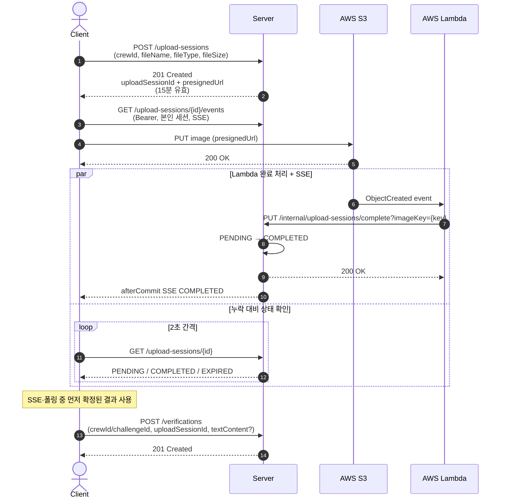
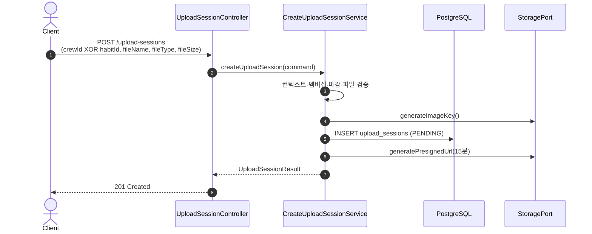
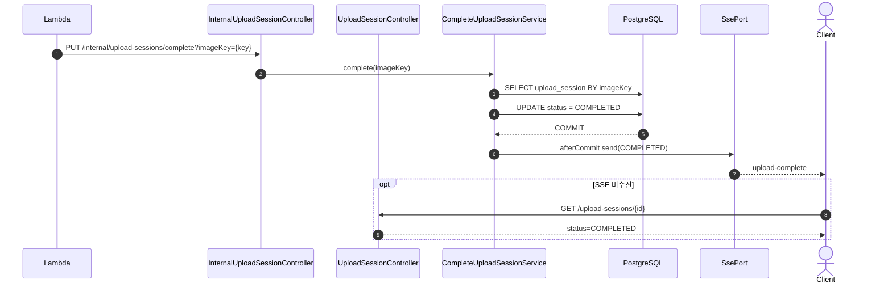
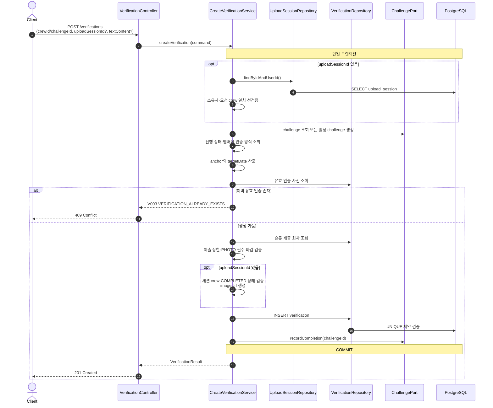

# 시퀀스 다이어그램 - 인증 업로드

> 정본 규칙: [`../biz-logic.md`](../biz-logic.md) · API 계약: [`../api-spec/verification.md`](../api-spec/verification.md) · 내부 API: [`../api-spec/internal.md`](../api-spec/internal.md)

## 1. 사진 인증 전체 흐름

```mermaid
sequenceDiagram
    autonumber
    actor Client
    participant Server
    participant S3 as AWS S3
    participant Lambda as AWS Lambda

    Client->>Server: POST /upload-sessions<br/>(crewId, fileName, fileType, fileSize)
    Server-->>Client: 201 Created<br/>uploadSessionId + presignedUrl<br/>(15분 유효)

    Client->>Server: GET /upload-sessions/{id}/events<br/>(Bearer, 본인 세션, SSE)
    Client->>S3: PUT image (presignedUrl)
    S3-->>Client: 200 OK

    par Lambda 완료 처리 + SSE
        S3->>Lambda: ObjectCreated event
        Lambda->>Server: PUT /internal/upload-sessions/complete?imageKey={key}
        Server->>Server: PENDING → COMPLETED
        Server-->>Lambda: 200 OK
        Server-->>Client: afterCommit SSE COMPLETED
    and 누락 대비 상태 확인
        loop 2초 간격
            Client->>Server: GET /upload-sessions/{id}
            Server-->>Client: PENDING / COMPLETED / EXPIRED
        end
    end

    Note over Client: SSE·폴링 중 먼저 확정된 결과 사용
    Client->>Server: POST /verifications<br/>(crewId/challengeId, uploadSessionId, textContent?)
    Server-->>Client: 201 Created
```

SSE와 상태 조회는 로그인한 세션 소유자만 사용할 수 있다. 연결 실패나 이벤트 유실이 인증 실패로 이어지지 않도록 클라이언트는 상태 조회를 병렬 수행한다. `COMPLETED` 또는 `EXPIRED`를 먼저 확인한 채널의 결과를 사용하고 나머지 대기를 종료한다.

## 2. `POST /upload-sessions`

```mermaid
sequenceDiagram
    autonumber
    actor Client
    participant Controller as UploadSessionController
    participant Service as CreateUploadSessionService
    participant DB as PostgreSQL
    participant Storage as StoragePort

    Client->>Controller: POST /upload-sessions<br/>(crewId XOR habitId, fileName, fileType, fileSize)
    Controller->>Service: createUploadSession(command)
    Service->>Service: 컨텍스트·멤버십·마감·파일 검증
    Service->>Storage: generateImageKey()
    Service->>DB: INSERT upload_sessions (PENDING)
    Service->>Storage: generatePresignedUrl(15분)
    Service-->>Controller: UploadSessionResult
    Controller-->>Client: 201 Created
```

- `crewId`와 `habitId` 중 정확히 하나만 전달한다.
- 허용 타입은 `image/jpeg`, `image/png`, `image/webp`, 최대 크기는 5MB다.
- `requestedAt`은 서버 시간이며 사진 인증의 마감 판정 기준점이다.
- 15분 이상 지난 PENDING 세션은 5분 주기 스케줄러가 EXPIRED로 전환한다.

## 3. 업로드 완료 처리와 상태 확인

```mermaid
sequenceDiagram
    autonumber
    participant Lambda
    participant Controller as InternalUploadSessionController
    participant StatusController as UploadSessionController
    participant Service as CompleteUploadSessionService
    participant DB as PostgreSQL
    participant SSE as SsePort
    actor Client

    Lambda->>Controller: PUT /internal/upload-sessions/complete?imageKey={key}
    Controller->>Service: complete(imageKey)
    Service->>DB: SELECT upload_session BY imageKey
    Service->>DB: UPDATE status = COMPLETED
    DB-->>Service: COMMIT
    Service->>SSE: afterCommit send(COMPLETED)
    SSE-->>Client: upload-complete

    opt SSE 미수신
        Client->>StatusController: GET /upload-sessions/{id}
        StatusController-->>Client: status=COMPLETED
    end
```

완료 콜백은 이미 COMPLETED인 세션에 다시 들어와도 성공하는 멱등 처리다. EXPIRED 세션은 COMPLETED로 되돌리지 않는다.

## 4. `POST /verifications`

```mermaid
sequenceDiagram
    autonumber
    actor Client
    participant Controller as VerificationController
    participant Service as CreateVerificationService
    participant SessionRepo as UploadSessionRepository
    participant VerificationRepo as VerificationRepository
    participant Challenge as ChallengePort
    participant DB as PostgreSQL

    Client->>Controller: POST /verifications<br/>(crewId/challengeId, uploadSessionId?, textContent?)
    Controller->>Service: createVerification(command)
    Note over Service,DB: 단일 트랜잭션

    opt uploadSessionId 있음
        Service->>SessionRepo: findByIdAndUserId()
        SessionRepo->>DB: SELECT upload_session
        Service->>Service: 소유자·요청 crew 일치 선검증
    end

    Service->>Challenge: challenge 조회 또는 활성 challenge 생성
    Service->>Service: 진행 상태·멤버십·인증 방식 조회
    Service->>Service: anchor와 targetDate 산출
    Service->>VerificationRepo: 유효 인증 사전 조회

    alt 이미 유효 인증 존재
        Service-->>Controller: V003 VERIFICATION_ALREADY_EXISTS
        Controller-->>Client: 409 Conflict
    else 생성 가능
        Service->>VerificationRepo: 슬롯 제출 회차 조회
        Service->>Service: 제출 상한·PHOTO 필수·마감 검증
        opt uploadSessionId 있음
            Service->>Service: 세션 crew·COMPLETED 상태 검증<br/>imageUrl 생성
        end
        Service->>VerificationRepo: INSERT verification
        VerificationRepo->>DB: UNIQUE 제약 검증
        Service->>Challenge: recordCompletion(challengeId)
        Note over Service,DB: COMMIT
        Service-->>Controller: VerificationResult
        Controller-->>Client: 201 Created
    end
```

### 중복·재사용 최종 방어

| 대상 | DB 제약 | 오류 |
|------|---------|------|
| 같은 유저·크루·날짜의 유효 인증 | `uk_verifications_user_crew_date_active` (`status <> 'CANCELLED'`) | `409 V003` |
| 같은 업로드 세션 재사용 | `uk_verifications_upload_session` | `409 V015` |

`POST /verifications`는 Idempotency-Key나 Redis 분산 락을 사용하지 않는다. 첫 요청이 성공한 뒤 같은 요청을 다시 보내면 기존 응답을 재사용하지 않고 중복 오류를 반환한다.

## 5. 실패 대책

| 실패 상황 | 처리 |
|-----------|------|
| S3 업로드 실패 | 클라이언트가 재시도하고, URL이 만료됐으면 새 세션을 발급받음 |
| SSE 연결 실패·이벤트 유실 | 2초 간격 상태 조회가 COMPLETED/EXPIRED를 확인 |
| Lambda 또는 내부 완료 호출 실패 | 세션은 PENDING으로 남고 최종적으로 만료됨. 재시도·DLQ의 실제 AWS 설정은 저장소 밖 운영 설정 확인 필요 |
| PENDING 세션 방치 | 서버 스케줄러가 15분 경과분을 5분 주기로 EXPIRED 처리 |
| 인증 INSERT 실패 | 인증 트랜잭션은 롤백되지만 완료된 업로드 세션은 유지되어 재시도 가능 |
| 성공 응답만 유실 | 재요청은 V003 또는 V015로 실패하며 기존 성공 응답을 재생하지 않음 |

## 6. 트랜잭션 경계

- 업로드 완료는 DB 커밋 후 SSE를 전송한다. 롤백된 상태를 COMPLETED로 알리지 않는다.
- 인증 생성은 검증 INSERT와 challenge 완료 일수 반영을 하나의 트랜잭션에서 처리한다.
- 인증 중복 방지의 최종 기준은 애플리케이션 선조회가 아니라 DB UNIQUE 제약이다.
