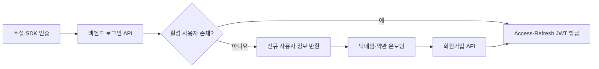

# User Context — 현행 개요

> 이 문서는 User Context의 현재 동작을 요약한다. 요청·응답·에러 코드의 정본은
> [`api-spec/auth-user.md`](./api-spec/auth-user.md), DB 구조의 정본은
> [`schema.md`](./schema.md), 가입·탈퇴 정책의 정본은 [`biz-logic.md`](./biz-logic.md)다.

---

## 1. 책임

User Context는 다음을 담당한다.

- 카카오·Apple 소셜 인증과 회원가입
- 자체 JWT 발급·갱신·검증
- 사용자 프로필과 FCM 토큰 관리
- 회원탈퇴, 소셜 연결 해제, 재가입

---

## 2. 로그인과 회원가입

카카오와 Apple 모두 **로그인과 회원가입이 분리**되어 있다. 신규 소셜 사용자는 로그인 API에서
DB에 생성되지 않고 JWT도 받지 않는다. 클라이언트가 온보딩에서 닉네임과 약관 동의를 받은 뒤
별도 회원가입 API를 호출한다.

### 카카오

| 단계 | API | 현행 동작 |
|---|---|---|
| 로그인 | `POST /auth/kakao` | 카카오 access token으로 사용자를 확인한다. 활성 사용자는 JWT를 받고, 신규·탈퇴 사용자는 가입용 카카오 정보만 받는다. |
| 회원가입 | `POST /auth/signup` | 카카오 ID 소유권, 닉네임, 약관 동의를 검증한 뒤 신규 생성하거나 탈퇴 계정을 재활성화하고 JWT를 발급한다. |

- 카카오 access token은 사용자 확인에 사용하며 DB에 저장하지 않는다.
- 기존 사용자 로그인 시 email과 profileImageUrl을 소셜 프로필로 동기화하지 않는다.
- 가입·재가입 시점에는 카카오에서 받은 email과 profileImageUrl을 저장한다.

### Apple

| 단계 | API | 현행 동작 |
|---|---|---|
| 로그인 | `POST /auth/apple` | Apple identity token을 검증한다. 활성 사용자는 JWT를 받고, 신규·탈퇴 사용자는 가입용 Apple 정보만 받는다. |
| 회원가입 | `POST /auth/apple-signup` | Apple ID 소유권, 닉네임, 약관 동의를 검증하고 authorization code를 refresh token으로 교환한 뒤 생성·재활성화한다. |

- Apple은 프로필 이미지를 제공하지 않으므로 가입·재가입 시 profileImageUrl은 null이다.
- 회원가입의 authorization code 교환이 실패하면 가입하지 않는다.
- 기존 사용자가 authorization code를 함께 보내면 Apple refresh token 저장을 best-effort로 보완한다.
- 기존 사용자 로그인에서 Apple이 email을 제공한 경우에만 저장된 email을 동기화한다.

---

## 3. 사용자 식별과 저장 정보

현재 `users.id`에는 카카오 고유 ID 또는 Apple `sub`를 문자열로 저장한다. `provider`에는
`KAKAO` 또는 `APPLE`을 저장하며 별도의 provider ID 컬럼은 없다.

| 필드 | 용도 |
|---|---|
| `id` | 소셜 제공자의 사용자 ID, PK |
| `provider` | `KAKAO` 또는 `APPLE` |
| `email` | 소셜 제공자가 전달한 경우 저장, nullable |
| `nickname` | 서비스 닉네임 |
| `profile_image_url` | 사용자 프로필 이미지, nullable |
| `fcm_token` | 푸시 알림용 기기 토큰, nullable |
| `apple_refresh_token` | Apple 연결 해제용 토큰, AES-256-GCM 암호화 저장, nullable |
| `terms_agreed_at` | 가입 시 약관 동의 시각 |
| `deleted_at` | soft delete 시각, 활성 사용자는 null |
| `token_version` | 탈퇴·재가입 전후 기존 JWT 무효화 기준 |

닉네임은 2~12자의 한글·영문·숫자·언더스코어만 허용한다 (`^[가-힣a-zA-Z0-9_]{2,12}$`). 앞뒤 공백은 트림한 뒤 검증·저장한다. 문자열 중간 공백은 어느 경로에서도 허용되지 않는다.

---

## 4. JWT 정책

| 항목 | Access Token | Refresh Token |
|---|---|---|
| 유효기간 | 30분 | 14일 |
| 용도 | 보호 API 인증 | 새 Access Token 발급 |
| 주요 claim | `sub`, `provider`, `type=access`, `tv` | `sub`, `type=refresh`, `tv` |
| 서명 | HS256 | HS256 |

- 보호 API는 `Authorization: Bearer <accessToken>`으로 인증한다.
- `POST /auth/refresh`는 Refresh Token과 현재 사용자의 `token_version`을 검증하고 새 Access Token만 발급한다.
- Refresh Token rotation과 서버 측 Refresh Token 저장소는 사용하지 않는다.
- `POST /auth/logout`은 Phase 1에서 서버 상태를 변경하지 않는다. 클라이언트가 보관한 토큰을 삭제한다.
- 탈퇴·재가입으로 `token_version`이 바뀌면 이전 Access·Refresh Token은 더 이상 유효하지 않다.
- `X-User-Id` 인증 fallback은 `!prod` 환경의 개발·테스트 지원용이며 운영 인증 계약이 아니다.

---

## 5. 프로필

현재 제공하는 사용자 기능은 다음과 같다.

- 내 프로필 조회
- 닉네임 변경
- 프로필 이미지용 presigned upload URL 발급
- S3 업로드 후 프로필 이미지 URL 반영 또는 기본 이미지로 초기화
- FCM 토큰 등록·갱신

로그인 때마다 소셜 프로필 전체를 덮어쓰지 않는다. 카카오 기존 사용자의 email·프로필 이미지는
동기화하지 않고, Apple 기존 사용자는 Apple이 다시 제공한 email만 동기화할 수 있다.

---

## 6. 회원탈퇴

회원탈퇴는 사용자 행을 삭제하지 않는 soft delete다.

1. Apple 사용자이고 저장된 Apple refresh token이 있으면 트랜잭션 밖에서 Apple revoke를 시도한다.
2. revoke 실패는 경고로 기록하고 탈퇴는 계속한다.
3. 참여 중인 크루와 챌린지를 정리한다.
4. 닉네임을 `탈퇴한 사용자`로 바꾸고 email, profileImageUrl, fcmToken, Apple refresh token을 비운다.
5. `deleted_at`을 기록하고 `token_version`을 증가시켜 기존 JWT를 무효화한다.

크루장은 혼자 남은 크루를 삭제하고, 다른 멤버가 있으면 가장 오래된 멤버에게 크루장 역할을
위임한 뒤 탈퇴한다. 일반 멤버는 크루에서 제거된다.

---

## 7. 재가입

같은 소셜 계정으로 다시 가입하면 새 사용자 행을 만들지 않고 탈퇴한 행을 재활성화한다.

- 닉네임, email, profileImageUrl과 Apple refresh token을 가입 시점 값으로 갱신한다.
- Apple의 profileImageUrl은 null이다.
- `deleted_at`을 null로 되돌리고 `token_version`을 다시 증가시킨다.
- 가입 완료 후 새 Access·Refresh Token을 발급한다.

기존 활성 사용자가 회원가입 API를 다시 호출하면 중복 가입 오류로 처리한다.
